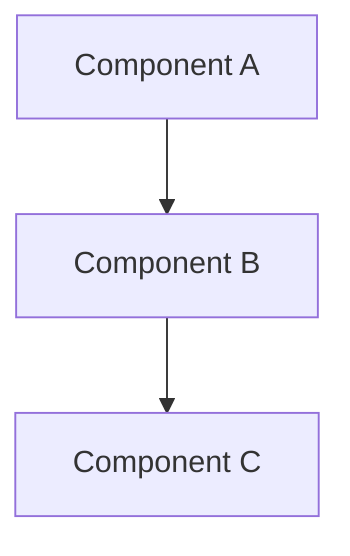
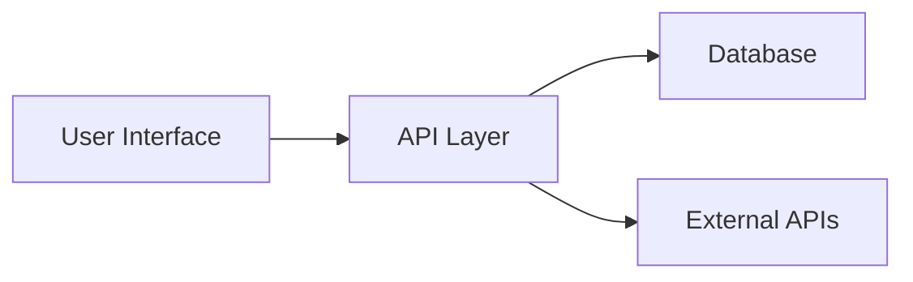
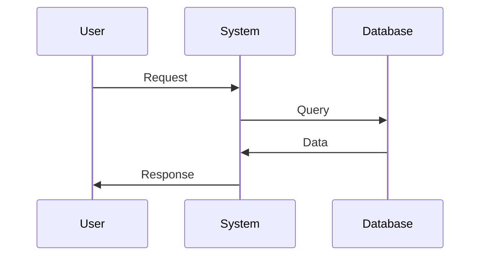
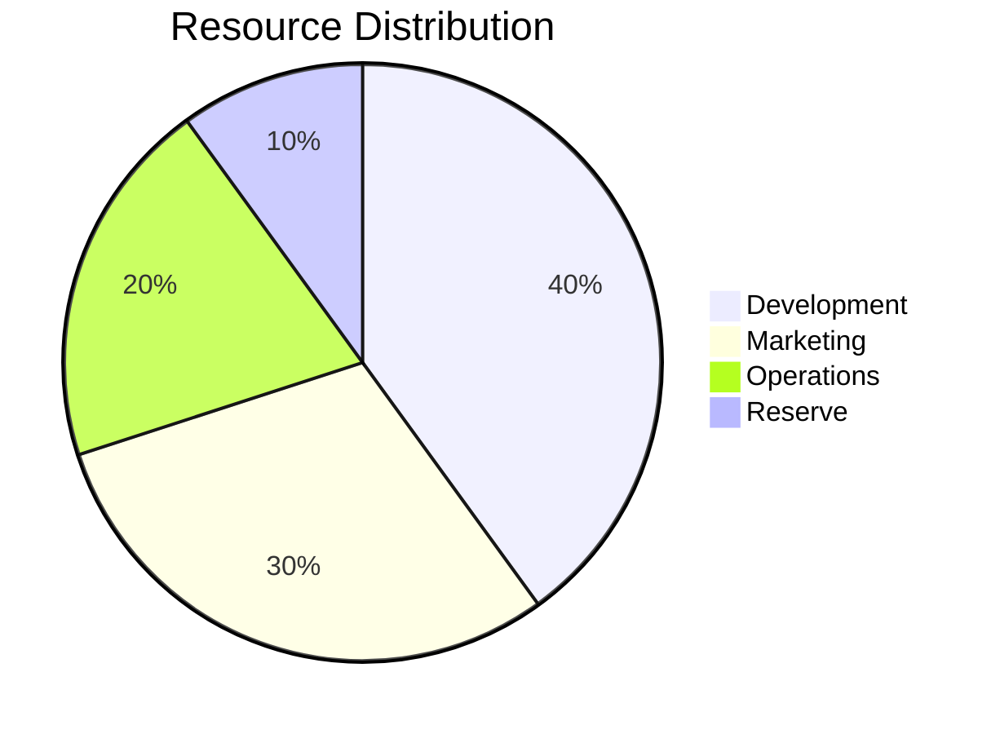

# Ideas

This directory contains initial concepts and brainstorms.

## Template

When adding a new idea, use this structure:

```markdown
# Idea Title

## Problem Statement
What problem does this solve?

## Proposed Solution
High-level approach

## Key Features
- Feature 1
- Feature 2
- Feature 3

## System Architecture (Optional)


## Technical Considerations
Initial thoughts on implementation

## Next Steps
What would move this forward?
```

## Visual Documentation

Our brainstorm ideas include comprehensive Mermaid diagrams to illustrate:

- **System Architecture**: High-level component relationships and data flow
- **Sequence Diagrams**: Step-by-step process flows and interactions
- **Process Flows**: Decision trees and workflow logic
- **Data Visualization**: Pie charts, graphs, and metrics displays

### Example Diagram Types

**Architecture Overview:**


**Process Flow:**


**Strategy Allocation:**


## Ideas Index

### Polkadot Ecosystem
- **[Polkadot Cross-Chain Arbitrage System](./polkadot-arbitrage-system.md)** - Automated arbitrage across parachains and exchanges
- **[Cross-Parachain DeFi Yield Aggregator](./polkadot-defi-yield-aggregator.md)** - Intelligent yield optimization across Polkadot DeFi

### Web3 Foundation Grant Opportunities
- **[Parachain Analytics & Governance Intelligence Platform](./web3-parachain-analytics-platform.md)** - Comprehensive ecosystem analytics and governance insights
- **[XCM Developer Toolkit & Testing Framework](./xcm-developer-toolkit.md)** - Tools to simplify cross-chain development