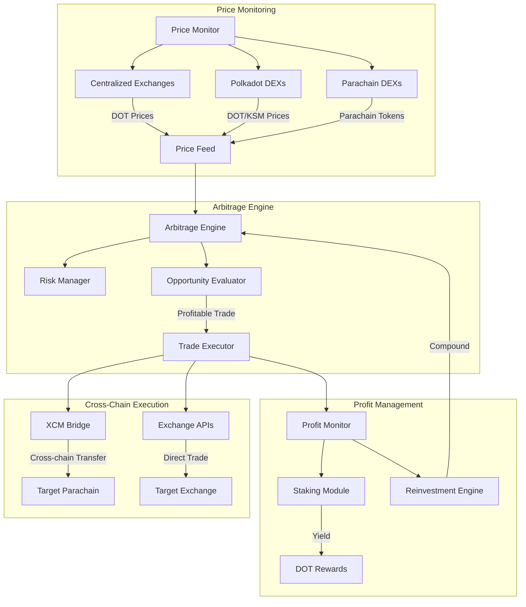
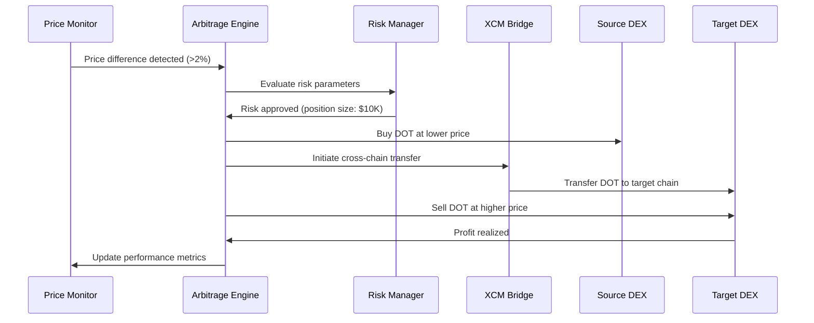

# Polkadot Cross-Chain Arbitrage System

## Problem Statement
Price discrepancies exist across different parachains and centralized exchanges for DOT and parachain tokens, creating arbitrage opportunities that are currently underexploited due to complexity and speed requirements.

## Proposed Solution
An automated arbitrage system that monitors price differences across Polkadot ecosystem exchanges, parachains, and DEXs, executing profitable trades while managing cross-chain bridge risks and timing.

## Key Features
- **Real-time Price Monitoring**: Track DOT prices across major CEXs (Binance, Coinbase, Kraken) and DEXs (Polkadex, HydraDX)
- **Cross-Chain Bridge Integration**: Utilize XCM for seamless parachain token transfers
- **Risk Management**: Dynamic position sizing based on bridge fees, slippage, and timing risks
- **Automated Execution**: Smart contract-based trade execution with minimal human intervention
- **Yield Optimization**: Reinvest profits into high-yield Polkadot staking or DeFi protocols

## System Architecture

## Arbitrage Flow Process

## Technical Considerations
- **Substrate Integration**: Build on Substrate for native Polkadot ecosystem compatibility
- **XCM Messaging**: Leverage Cross-Consensus Message format for parachain communication
- **Oracle Networks**: Integrate Chainlink or Acurast for reliable price feeds
- **MEV Protection**: Implement strategies to avoid maximal extractable value attacks
- **Liquidity Analysis**: Real-time assessment of available liquidity before trade execution

## Market Analysis
- **Target Markets**: DOT, KSM, GLMR, ASTR, ACA, and other major parachain tokens
- **Volume Requirements**: Minimum $10K trade sizes for meaningful profit after fees
- **Frequency**: Potential for 5-15 profitable opportunities daily during volatile periods
- **Competition**: Limited sophisticated arbitrage tools in Polkadot ecosystem

## Revenue Model
- **Performance Fees**: 20% of profits generated
- **Subscription Tiers**: $99/month retail, $999/month institutional
- **Yield Sharing**: 50/50 split on staking rewards from reinvested profits

## Next Steps
1. Market research on current arbitrage volumes and opportunities
2. Technical feasibility study on XCM integration complexity
3. Partnership discussions with Polkadot DEXs for API access
4. Prototype development for price monitoring and alert system