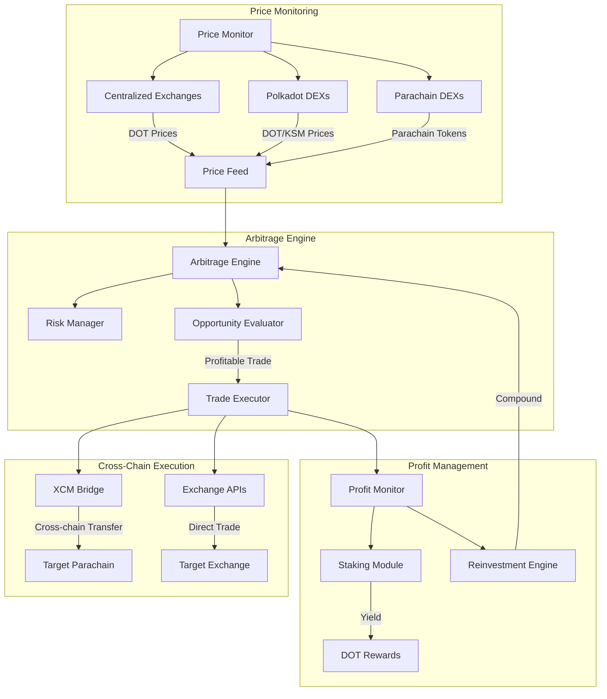
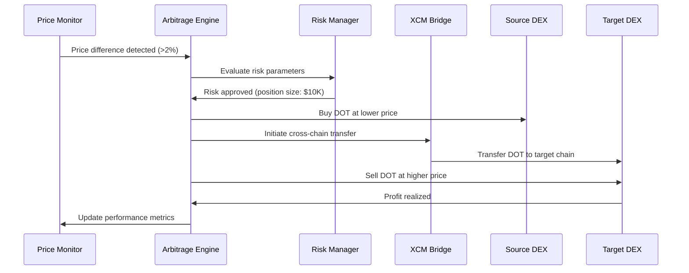
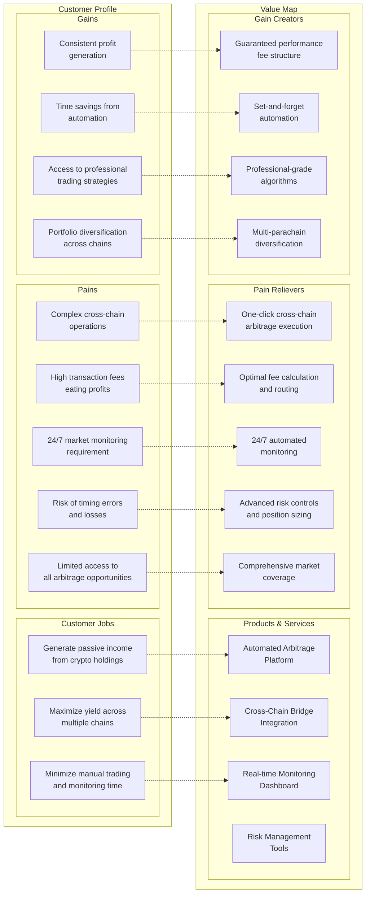
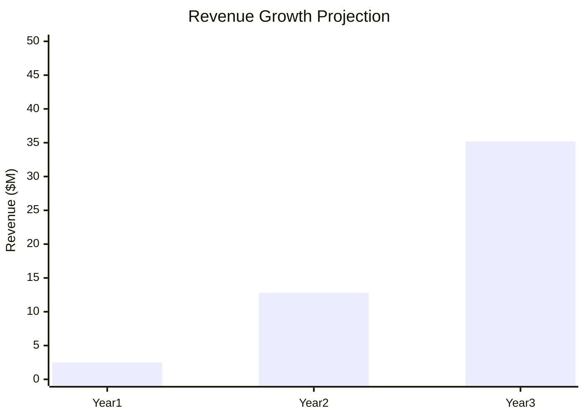
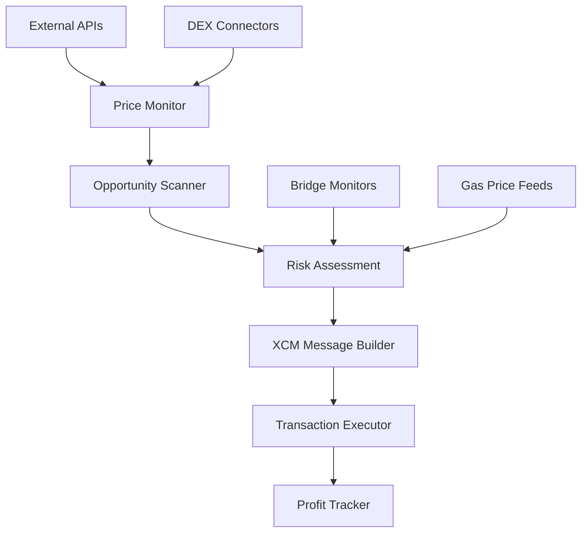

# Polkadot Cross-Chain Arbitrage System

## Problem Statement
Price discrepancies exist across different parachains and centralized exchanges for DOT and parachain tokens, creating arbitrage opportunities that are currently underexploited due to complexity and speed requirements.

## Proposed Solution
An automated arbitrage system that monitors price differences across Polkadot ecosystem exchanges, parachains, and DEXs, executing profitable trades while managing cross-chain bridge risks and timing.

## Key Features
- **Real-time Price Monitoring**: Track DOT prices across major CEXs (Binance, Coinbase, Kraken) and DEXs (Polkadex, HydraDX)
- **Cross-Chain Bridge Integration**: Utilize XCM for seamless parachain token transfers
- **Risk Management**: Dynamic position sizing based on bridge fees, slippage, and timing risks
- **Automated Execution**: Smart contract-based trade execution with minimal human intervention
- **Yield Optimization**: Reinvest profits into high-yield Polkadot staking or DeFi protocols

## System Architecture



## Arbitrage Flow Process



## Technical Considerations
- **Substrate Integration**: Build on Substrate for native Polkadot ecosystem compatibility
- **XCM Messaging**: Leverage Cross-Consensus Message format for parachain communication
- **Oracle Networks**: Integrate Chainlink or Acurast for reliable price feeds
- **MEV Protection**: Implement strategies to avoid maximal extractable value attacks
- **Liquidity Analysis**: Real-time assessment of available liquidity before trade execution

## Market Analysis
- **Target Markets**: DOT, KSM, GLMR, ASTR, ACA, and other major parachain tokens
- **Volume Requirements**: Minimum $10K trade sizes for meaningful profit after fees
- **Frequency**: Potential for 5-15 profitable opportunities daily during volatile periods
- **Competition**: Limited sophisticated arbitrage tools in Polkadot ecosystem

## Revenue Model
- **Performance Fees**: 20% of profits generated
- **Subscription Tiers**: $99/month retail, $999/month institutional
- **Yield Sharing**: 50/50 split on staking rewards from reinvested profits

## Business Model Canvas

```mermaid
graph TB
    subgraph "Key Partners"
        KP1[Polkadot DEXs<br/>Polkadex, HydraDX]
        KP2[CEX Partners<br/>Binance, Coinbase]
        KP3[Oracle Providers<br/>Chainlink, Acurast]
        KP4[Infrastructure<br/>Archive Nodes, RPCs]
    end

    subgraph "Key Activities"
        KA1[Price Monitoring<br/>24/7 Operations]
        KA2[Risk Management<br/>Position Sizing]
        KA3[Platform Development<br/>Smart Contracts]
        KA4[Customer Support<br/>Technical Support]
    end

    subgraph "Value Propositions"
        VP1[Automated Profit<br/>Hands-off Income]
        VP2[Cross-Chain Access<br/>Unified Platform]
        VP3[Risk Mitigation<br/>Advanced Algorithms]
        VP4[Transparency<br/>Real-time Reports]
    end

    subgraph "Customer Relationships"
        CR1[Self-Service<br/>Dashboard Platform]
        CR2[Community<br/>Discord/Telegram]
        CR3[Personal Support<br/>Premium Tiers]
        CR4[Educational Content<br/>Tutorials, Webinars]
    end

    subgraph "Customer Segments"
        CS1[Retail Crypto Traders<br/>$1K - $100K portfolios]
        CS2[Institutional Funds<br/>$100K+ allocations]
        CS3[DeFi Yield Farmers<br/>Multi-chain strategies]
        CS4[Passive Income Seekers<br/>Set-and-forget users]
    end

    subgraph "Key Resources"
        KR1[Proprietary Algorithms<br/>Arbitrage Detection]
        KR2[Technical Team<br/>Substrate Developers]
        KR3[Capital Pool<br/>Operational Funds]
        KR4[Market Data<br/>Real-time Feeds]
    end

    subgraph "Channels"
        CH1[Web Platform<br/>Primary Interface]
        CH2[Mobile App<br/>iOS/Android]
        CH3[API Access<br/>Institutional Clients]
        CH4[Partner Integrations<br/>Wallet Partnerships]
    end

    subgraph "Cost Structure"
        COST1[Development Costs: 40%<br/>Team, Infrastructure]
        COST2[Operational Costs: 30%<br/>Bridge Fees, Gas]
        COST3[Marketing: 20%<br/>User Acquisition]
        COST4[Compliance: 10%<br/>Legal, Regulatory]
    end

    subgraph "Revenue Streams"
        REV1[Performance Fees: 60%<br/>20% of profits]
        REV2[Subscription Fees: 25%<br/>Monthly tiers]
        REV3[API Licensing: 10%<br/>Institutional access]
        REV4[Yield Sharing: 5%<br/>Staking rewards]
    end
```



## Value Proposition Canvas



## Financial Model

### Revenue Projections (3-Year)



### Unit Economics

| Metric | Value | Calculation |
|--------|--------|-------------|
| **Average Customer AUM** | $25,000 | Blended retail/institutional |
| **Annual Performance Fee** | 20% | Industry standard |
| **Average Annual Profit** | 15% | Conservative estimate |
| **Revenue per Customer** | $750/year | $25K × 15% × 20% |
| **Customer Acquisition Cost** | $150 | Marketing spend |
| **Customer Lifetime Value** | $2,250 | 3-year average retention |
| **LTV:CAC Ratio** | 15:1 | Excellent unit economics |

### Monthly Recurring Revenue Model

| Tier | Price | Features | Target Users | Projected Users Y1 |
|------|-------|----------|-------------|-------------------|
| **Starter** | $99/month | Up to $10K AUM | Retail traders | 500 |
| **Professional** | $299/month | Up to $100K AUM | Serious traders | 200 |
| **Institutional** | $999/month | Unlimited AUM | Funds, whales | 50 |

### Financial Projections

| Year | Users | AUM ($M) | Performance Revenue ($M) | Subscription Revenue ($M) | Total Revenue ($M) | Operating Costs ($M) | Net Profit ($M) |
|------|-------|----------|------------------------|-------------------------|-------------------|-------------------|-----------------|
| **1** | 750 | 18.75 | 0.56 | 1.35 | **2.5** | 3.2 | **(0.7)** |
| **2** | 2,500 | 85 | 2.55 | 4.5 | **12.8** | 8.5 | **4.3** |
| **3** | 5,000 | 200 | 6.0 | 9.0 | **35.2** | 18.0 | **17.2** |

### Break-Even Analysis

```mermaid
xychart-beta
    title "Break-Even Timeline"
    x-axis [Q1, Q2, Q3, Q4, Q5, Q6, Q7, Q8]
    y-axis "Cash Flow ($K)" -800 --> 400
    line [(-200), (-450), (-600), (-700), (-500), (-200), 100, 350]
```

**Break-even achieved in Q7 (Month 19)**

### Funding Requirements

- **Seed Round**: $2M (18-month runway)
- **Series A**: $8M (scale operations, international expansion)
- **Use of Funds**:
  - Development: 40% ($800K)
  - Operations: 30% ($600K)
  - Marketing: 20% ($400K)
  - Legal/Compliance: 10% ($200K)

## Implementation Roadmap (Updated September 2025)

### Phase 1: Market Research & Technical Validation ✅

#### Market Research Findings
**Current Arbitrage Opportunities (September 2025):**
- **DOT Trading**: Current price $4.27 USD with $325M+ daily volume
- **PDEX Arbitrage**: Active opportunities with 1.68% spreads (AscendEX → HotBit)
- **Typical Spreads**: 0.1% to 2.5% range, with $50+ profit opportunities being rare
- **Transaction Speed**: BSC network enables 10-20 minute arbitrage cycles
- **Competition**: CEX/DEX arbitrage creates majority of DEX volume

**Key DEX Ecosystem:**
- **HydraDX**: Omnipool model eliminating liquidity fragmentation
- **Polkadex**: Hybrid orderbook-AMM with 500K TPS, zero gas fees
- **Volume Analysis**: PDEX 24h volume $155,859, ecosystem fragmentation creates opportunities

#### Technical Feasibility Assessment
**XCM Integration Complexity (2025 Standards):**
- **Documentation**: Comprehensive resources updated through August 2025
- **Implementation**: XCM v3 with advanced programmability features
- **Challenge Areas**:
  - Asset registration requires runtime integration
  - HRMP channel establishment between parachains
  - Transact instruction needs specific runtime knowledge
  - Virtual machine execution state management

**Infrastructure Requirements:**
- Substrate/Rust expertise mandatory
- Archive node access for historical data
- Multiple RPC endpoints for redundancy
- Custom pallets for arbitrage logic

### Phase 2: Partnership Development & API Integration

#### DEX Partnership Strategy
**Polkadex Integration:**
- ✅ Hummingbot connector available (under development)
- ✅ Zero network fees enable profitable bot trading
- ✅ API access via orderbook and AMM endpoints
- 🔄 **Action**: Engage with Polkadex team for direct API partnerships

**HydraDX Integration:**
- ✅ EVM compatibility with MetaMask support
- ✅ RPC providers (OnFinality) offer infrastructure access
- ✅ Omnipool provides unique arbitrage opportunities
- 🔄 **Action**: Evaluate Omnipool integration complexity

**Infrastructure Partnerships:**
- OnFinality for HydraDX RPC access
- Multiple node providers for redundancy
- Oracle partnerships (Chainlink, Acurast) for price feeds

### Phase 3: MVP Development (Q1 2025)

#### Core Components


#### Technical Specifications
**Minimum Viable Product:**
1. **Price Monitoring System**
   - Real-time feeds from 5+ exchanges
   - DOT/USDC price tracking across CEX/DEX
   - Alert system for >1% spreads

2. **Risk Management Module**
   - Dynamic position sizing
   - Bridge fee calculation
   - Slippage protection (max 0.5%)
   - Emergency stop mechanisms

3. **XCM Integration Layer**
   - HRMP channel management
   - Asset transfer logic
   - Cross-chain transaction batching
   - Error handling and retry logic

#### Development Timeline
| Phase | Duration | Deliverables | Investment |
|-------|----------|-------------|------------|
| **Research & Design** | 2 months | Technical architecture, partnerships | $50K |
| **MVP Development** | 4 months | Core arbitrage engine, basic UI | $200K |
| **Testing & Refinement** | 2 months | Testnet deployment, optimization | $75K |
| **Launch Preparation** | 2 months | Security audits, mainnet deployment | $100K |

### Phase 4: Market Entry Strategy

#### Go-to-Market Approach
**Target Markets (Priority Order):**
1. **DOT/USDC Arbitrage**: Highest volume, most liquid
2. **Cross-DEX Opportunities**: HydraDX ↔ Polkadex spreads
3. **Parachain Token Arbitrage**: GLMR, ASTR, ACA tokens
4. **CEX-DEX Arbitrage**: Traditional exchange differentials

**Customer Acquisition:**
- **Beta Program**: 50 early users with $10K+ portfolios
- **Community Building**: Polkadot governance participation
- **Performance Marketing**: Results-driven advertising
- **Strategic Partnerships**: Integration with wallet providers

### Risk Mitigation & Monitoring

#### Technical Risks
- **XCM Protocol Changes**: Monitor Parity updates, modular design
- **Bridge Failures**: Multiple route redundancy, failure detection
- **MEV Competition**: Private mempools, timing optimization
- **Smart Contract Bugs**: Multiple audits, gradual deployment

#### Market Risks
- **Reduced Spreads**: Market efficiency improvements over time
- **Increased Competition**: First-mover advantage critical
- **Regulatory Changes**: Compliance framework development
- **Bear Market Impact**: Reduced trading volumes

### Success Metrics (6-Month Targets)

| Metric | Target | Current Baseline |
|--------|--------|-----------------|
| **Daily Trading Volume** | $500K | $0 |
| **Average Profit per Trade** | 1.2% | N/A |
| **User AUM** | $5M | $0 |
| **Monthly Active Trades** | 1,000+ | N/A |
| **System Uptime** | 99.5% | N/A |

### Immediate Action Items (Next 30 Days)

1. **Partnership Outreach**
   - Schedule calls with Polkadex business development
   - Contact HydraDX technical team for integration discussion
   - Engage with OnFinality for infrastructure partnership

2. **Technical Preparation**
   - Set up Substrate development environment
   - Deploy testnet nodes for HydraDX and Polkadex
   - Begin XCM message format testing

3. **Team Building**
   - Recruit Substrate/Rust developer
   - Hire DeFi trading specialist
   - Engage smart contract audit firm

4. **Funding Preparation**
   - Finalize pitch deck with market research
   - Prepare technical demo for investors
   - Research Web3 grant opportunities

**Next Review**: October 15, 2025 - Evaluate partnership progress and technical milestones