# Polkadot Arbitrage Agent - Personal Project

## Problem Statement
Michael and Bruno have identified arbitrage opportunities across Polkadot ecosystem exchanges but manual execution is time-intensive and error-prone. We need an intelligent agent to automate this process using our own capital.

## Proposed Solution
A collaborative development project to build a personal arbitrage agent that Michael and Bruno can each run independently using their own funds. Shared codebase, individual operation, no commercial intent - just a smart tool for personal trading optimization.

## Key Features
- **Collaborative Development**: Michael and Bruno share code development and strategy insights
- **Independent Operation**: Each person runs their own instance with personal capital and API keys
- **Real-time Price Monitoring**: Track DOT prices across major CEXs and DEXs (Polkadex, HydraDX)
- **Cross-Chain Integration**: Utilize XCM for seamless parachain arbitrage opportunities
- **Claude Flow AI**: Intelligent agents that learn and optimize trading strategies over time
- **Zero-Fee Strategy**: PDEX staking and Polkadot native ecosystem focus to minimize costs
- **Shared Learning**: Both instances contribute to strategy optimization and market insights

## System Architecture


## Arbitrage Flow Process


## Technical Considerations
- **Substrate Integration**: Build on Substrate for native Polkadot ecosystem compatibility
- **XCM Messaging**: Leverage Cross-Consensus Message format for parachain communication
- **Oracle Networks**: Integrate Chainlink or Acurast for reliable price feeds
- **MEV Protection**: Implement strategies to avoid maximal extractable value attacks
- **Liquidity Analysis**: Real-time assessment of available liquidity before trade execution

## Personal Trading Opportunity Analysis


## Personal Project Goals
- **Michael's Goal**: Generate $1K+/month passive income from $10K+ capital
- **Bruno's Goal**: Learn AI-powered trading while building personal wealth
- **Shared Goal**: Create reusable arbitrage infrastructure for future projects

## Project Structure - Michael & Bruno Collaboration


## Personal Project Benefits - Michael & Bruno


## Complete Cost & Return Analysis - Personal Collaboration

### Individual Investment Breakdown


### Detailed Cost Analysis (Per Person)


### Personal Return Projections


### Monthly P&L Projection (Individual)

```mermaid
gantt
    title Personal Monthly Returns Timeline
    dateFormat YYYY-MM
    axisFormat %b

    section Capital Growth
    $1K → $1.5K (Month 1)     :done, 2025-09, 30d
    $1.5K → $2.5K (Month 2)   :active, 2025-10, 30d
    $2.5K → $4.5K (Month 3)   :2025-11, 30d
    $4.5K → $7.9K (Month 4)   :2025-12, 30d
    $7.9K → $13K (Month 5)    :2026-01, 30d
    $13K → $22K (Month 6)     :2026-02, 30d
    $22K → $35K (Month 8)     :2026-04, 60d
    $35K → $61K (Month 12)    :2026-08, 120d

    section Development Milestones
    Basic Bot Complete        :milestone, 2025-11, 0d
    XCM Integration           :milestone, 2026-01, 0d
    Full Automation          :milestone, 2026-04, 0d
```



### Detailed Monthly Breakdown (Per Person)

| Month | Capital | Daily Profit | Monthly Costs | Net Profit | Ending Capital | ROI % |
|-------|---------|-------------|---------------|------------|----------------|-------|
| **1** | $1,000 | $15 | $75 | $375 | $1,450 | 45% |
| **2** | $1,450 | $35 | $75 | $975 | $2,510 | 73% |
| **3** | $2,510 | $65 | $75 | $1,940 | $4,490 | 83% |
| **4** | $4,490 | $110 | $75 | $3,335 | $7,855 | 79% |
| **5** | $7,855 | $180 | $75 | $5,505 | $13,380 | 73% |
| **6** | $13,380 | $280 | $75 | $8,605 | $21,995 | 67% |
| **7** | $21,995 | $420 | $75 | $12,945 | $28,540 | 61% |
| **8** | $28,540 | $550 | $75 | $16,975 | $35,215 | 63% |
| **9** | $35,215 | $680 | $75 | $21,005 | $41,820 | 62% |
| **10** | $41,820 | $810 | $75 | $25,035 | $48,355 | 61% |
| **11** | $48,355 | $940 | $75 | $29,065 | $54,920 | 61% |
| **12** | $54,920 | $1,070 | $75 | $33,095 | $61,415 | 61% |

### No Commercial Revenue Model - Pure Personal Use

**Project Investment Approach:**
- Each person invests their own $1K trading capital
- Shared development time and expertise
- No commercial licensing or sales
- Value creation through personal trading profits
- Open source collaboration for learning

### Development Funding Strategy


**Sustainable Development Loop:**
- Trading profits fund infrastructure costs
- Success motivates continued development
- Shared learning accelerates both instances
- No external dependencies or obligations

### Risk Analysis - Personal Project

| Risk | Impact | Probability | Mitigation |
|------|--------|-------------|------------|
| **Individual Capital Loss** | Medium | Low | Start small ($1K), good risk management |
| **Time Investment** | Low | Medium | 20hrs/week sustainable for side project |
| **Technical Complexity** | Medium | Medium | Collaborative development reduces risk |
| **Market Changes** | Low | High | Adaptable strategies, continuous learning |

### Legal Structure - Ultra Simple


**Legal Benefits:**
- No business registration required
- No commercial compliance
- Personal capital gains treatment
- No regulatory oversight needed

## Implementation Roadmap (Updated September 2025)

### Phase 1: Market Research & Technical Validation ✅

#### Market Research Findings
**Current Arbitrage Opportunities (September 2025):**
- **DOT Trading**: Current price $4.27 USD with $325M+ daily volume
- **PDEX Arbitrage**: Active opportunities with 1.68% spreads (AscendEX → HotBit)
- **Typical Spreads**: 0.1% to 2.5% range, with $50+ profit opportunities being rare
- **Transaction Speed**: BSC network enables 10-20 minute arbitrage cycles
- **Competition**: CEX/DEX arbitrage creates majority of DEX volume

**Key DEX Ecosystem:**
- **HydraDX**: Omnipool model eliminating liquidity fragmentation
- **Polkadex**: Hybrid orderbook-AMM with 500K TPS, zero gas fees
- **Volume Analysis**: PDEX 24h volume $155,859, ecosystem fragmentation creates opportunities

#### Technical Feasibility Assessment
**XCM Integration Complexity (2025 Standards):**
- **Documentation**: Comprehensive resources updated through August 2025
- **Implementation**: XCM v3 with advanced programmability features
- **Challenge Areas**:
  - Asset registration requires runtime integration
  - HRMP channel establishment between parachains
  - Transact instruction needs specific runtime knowledge
  - Virtual machine execution state management

**Infrastructure Requirements:**
- Substrate/Rust expertise mandatory
- Archive node access for historical data
- Multiple RPC endpoints for redundancy
- Custom pallets for arbitrage logic

### Phase 2: Partnership Development & API Integration

#### DEX Partnership Strategy
**Polkadex Integration:**
- ✅ Hummingbot connector available (under development)
- ✅ Zero network fees enable profitable bot trading
- ✅ API access via orderbook and AMM endpoints
- 🔄 **Action**: Engage with Polkadex team for direct API partnerships

**HydraDX Integration:**
- ✅ EVM compatibility with MetaMask support
- ✅ RPC providers (OnFinality) offer infrastructure access
- ✅ Omnipool provides unique arbitrage opportunities
- 🔄 **Action**: Evaluate Omnipool integration complexity

**Infrastructure Partnerships:**
- OnFinality for HydraDX RPC access
- Multiple node providers for redundancy
- Oracle partnerships (Chainlink, Acurast) for price feeds

### Phase 3: Agentic Self-Bootstrapping Development

#### Why Agentic Over Traditional Funding?

**Self-Funding Advantages:**
- Arbitrage profits immediately fund development costs
- No dilution or investor obligations
- Faster iteration cycles without approval processes
- Direct market validation from day one
- Compound growth from reinvested profits

**Realistic Bootstrap Capital ($1K Start):**


#### Agentic Development Architecture


#### Comprehensive Fee Analysis & Zero-Fee Strategy


#### Monthly Financial Projections ($1K Start)


#### Detailed Monthly Breakdown

**Month 1: Manual Validation ($1,000 → $1,500)**


| Week | Capital | Avg Daily Profit | Weekly Profit | Cumulative | Fees Paid |
|------|---------|------------------|---------------|------------|-----------|
| 1 | $1,000 | $12 | $84 | $1,084 | $2 |
| 2 | $1,084 | $15 | $105 | $1,189 | $3 |
| 3 | $1,189 | $18 | $126 | $1,315 | $4 |
| 4 | $1,315 | $22 | $154 | $1,469 | $5 |

**Month 2: Basic Automation ($1,500 → $2,800)**


| Week | Capital | Avg Daily Profit | Weekly Profit | Cumulative | Development Cost |
|------|---------|------------------|---------------|------------|------------------|
| 5 | $1,469 | $28 | $196 | $1,665 | $50 |
| 6 | $1,665 | $35 | $245 | $1,910 | $60 |
| 7 | $1,910 | $42 | $294 | $2,204 | $70 |
| 8 | $2,204 | $50 | $350 | $2,554 | $80 |

**Month 3: Enhanced Strategies ($2,800 → $5,500)**


**Month 4-6: Cross-Chain Integration ($5,500 → $25,000)**


#### Agentic Development Workflow

**Claude Flow Agent Specialization:**
1. **Market Research Agent**: Continuous opportunity scanning
2. **Development Agent**: Code generation, testing, deployment
3. **Trading Agent**: Strategy execution and optimization
4. **Risk Management Agent**: Position sizing, stop losses
5. **Performance Agent**: Analytics and reporting

**Development Cost Comparison:**
| Approach | Timeline | Capital Required | Risk Level |
|----------|----------|-----------------|------------|
| **Traditional VC** | 12-18 months | $425K | High (dilution) |
| **Self-Bootstrap** | 3-6 months | $5K initial | Low (self-funded) |
| **Agentic Hybrid** | 2-4 months | $5K initial | Minimal (AI-assisted) |

#### Technical Implementation: Agentic First

**Phase 1: Manual + Claude Flow (Week 1-2)**
```python
# Simple arbitrage detector built with Claude
def detect_arbitrage():
    prices = get_prices(['binance', 'polkadex'])
    spread = calculate_spread(prices)
    if spread > 1.5%:
        notify_opportunity(spread)
        return execute_if_profitable(spread)
```

**Phase 2: Automated Trading (Week 3-4)**
- Claude Flow orchestrates multiple trading agents
- Real-time price monitoring across 5+ exchanges
- Automated execution with risk limits

**Phase 3: Cross-Chain Integration (Month 2)**
- XCM message construction using Claude
- HydraDX Omnipool integration
- Multi-parachain opportunity scanning

**Phase 4: Advanced Strategies (Month 3+)**
- MEV protection algorithms
- Yield farming arbitrage
- Cross-chain flash loans

### Phase 4: Market Entry Strategy

#### Go-to-Market Approach
**Target Markets (Priority Order):**
1. **DOT/USDC Arbitrage**: Highest volume, most liquid
2. **Cross-DEX Opportunities**: HydraDX ↔ Polkadex spreads
3. **Parachain Token Arbitrage**: GLMR, ASTR, ACA tokens
4. **CEX-DEX Arbitrage**: Traditional exchange differentials

**Customer Acquisition:**
- **Beta Program**: 50 early users with $10K+ portfolios
- **Community Building**: Polkadot governance participation
- **Performance Marketing**: Results-driven advertising
- **Strategic Partnerships**: Integration with wallet providers

### Risk Mitigation & Monitoring

#### Technical Risks
- **XCM Protocol Changes**: Monitor Parity updates, modular design
- **Bridge Failures**: Multiple route redundancy, failure detection
- **MEV Competition**: Private mempools, timing optimization
- **Smart Contract Bugs**: Multiple audits, gradual deployment

#### Market Risks
- **Reduced Spreads**: Market efficiency improvements over time
- **Increased Competition**: First-mover advantage critical
- **Regulatory Changes**: Compliance framework development
- **Bear Market Impact**: Reduced trading volumes

### Success Metrics (6-Month Targets)

| Metric | Target | Current Baseline |
|--------|--------|-----------------|
| **Daily Trading Volume** | $500K | $0 |
| **Average Profit per Trade** | 1.2% | N/A |
| **User AUM** | $5M | $0 |
| **Monthly Active Trades** | 1,000+ | N/A |
| **System Uptime** | 99.5% | N/A |

### Agentic Revenue Model: Self-Sustaining Growth

#### Revenue Reinvestment Strategy


#### Complete 12-Month Financial Model ($1K → $50K+)

**Zero-Fee Strategy Implementation:**
```mermaid
graph TD
    A[Month 1: Stake PDEX] --> B[Zero Trading Fees Activated]
    B --> C[Focus on Polkadot Ecosystem]
    C --> D[Minimal Network Fees Only]
    D --> E[Fee Savings = Extra Profit]
    E --> F[Compound Growth Acceleration]
```

**Comprehensive Monthly Projections:**
| Month | Starting Capital | Avg Daily Profit | Monthly Profit | Total Fees | Net Growth | Ending Capital |
|-------|------------------|------------------|----------------|------------|------------|----------------|
| **1** | $1,000 | $15 | $465 | $15 | $450 | $1,450 |
| **2** | $1,450 | $35 | $1,085 | $25 | $1,060 | $2,510 |
| **3** | $2,510 | $65 | $2,015 | $35 | $1,980 | $4,490 |
| **4** | $4,490 | $110 | $3,410 | $45 | $3,365 | $7,855 |
| **5** | $7,855 | $180 | $5,580 | $55 | $5,525 | $13,380 |
| **6** | $13,380 | $280 | $8,680 | $65 | $8,615 | $21,995 |
| **7** | $21,995 | $420 | $13,020 | $75 | $12,945 | $34,940 |
| **8** | $34,940 | $600 | $18,600 | $85 | $18,515 | $53,455 |
| **9** | $53,455 | $800 | $24,800 | $95 | $24,705 | $78,160 |
| **10** | $78,160 | $1,000 | $31,000 | $105 | $30,895 | $109,055 |
| **11** | $109,055 | $1,200 | $37,200 | $115 | $37,085 | $146,140 |
| **12** | $146,140 | $1,400 | $43,400 | $125 | $43,275 | $189,415 |

**Fee Minimization Strategies:**
```mermaid
flowchart TD
    subgraph "Zero-Fee Ecosystem"
        A[PDEX Staking] --> B[0% Trading Fees on Polkadex]
        C[Native Polkadot] --> D[Minimal Gas ~$0.01]
        E[XCM Integration] --> F[Direct Parachain Access]
    end

    subgraph "Fee Comparison"
        G[Traditional CEX] --> H[0.1% per trade]
        I[Ethereum DEX] --> J[$20-50 gas fees]
        K[Our Strategy] --> L[<0.01% total cost]
    end

    B --> M[Net Profit Increase]
    D --> M
    F --> M
```

**Return on Investment Analysis:**
| Timeframe | Investment | Return | ROI | Annualized ROI |
|-----------|------------|--------|-----|----------------|
| **Month 3** | $1,000 | $3,490 | 349% | 1,396% |
| **Month 6** | $1,000 | $20,995 | 2,100% | 4,200% |
| **Month 12** | $1,000 | $188,415 | 18,842% | 18,842% |

**Risk-Adjusted Projections (Conservative Scenario):**
```mermaid
xychart-beta
    title "Growth Scenarios: Conservative vs Optimistic"
    x-axis [M1, M2, M3, M4, M5, M6, M7, M8, M9, M10, M11, M12]
    y-axis "Capital ($K)" 0 --> 200
    line [1.2, 2.0, 3.2, 5.5, 8.5, 13.0, 19.5, 28.0, 39.0, 52.5, 68.5, 87.0]
    line [1.5, 2.5, 4.5, 7.9, 13.4, 22.0, 34.9, 53.5, 78.2, 109.1, 146.1, 189.4]
```

**Approach Comparison: Commercial vs Personal Project**
| Metric | Commercial Software | Personal Collaboration Project |
|--------|-------------------|------------------------------|
| **Legal Complexity** | Business registration, licensing | No business entity required |
| **Revenue Model** | Software sales, subscriptions | Personal trading profits only |
| **Customer Support** | Documentation, help desk | Peer collaboration and learning |
| **Development Pressure** | Market deadlines, user demands | Personal timeline, learning focus |
| **Risk** | Business failure, market competition | Individual capital risk only |
| **Scalability** | Global commercial distribution | Limited to Michael and Bruno |
| **Focus** | Product-market fit, sales | Personal optimization, education |
| **Value Creation** | Software licensing revenue | Trading profits + knowledge |

### Fee-Optimized Implementation Strategy

#### Can It Be Done Without Fees? YES!
```mermaid
graph LR
    subgraph "Zero-Fee Path"
        A[Stake PDEX Tokens] --> B[0% Trading Fees]
        C[Use Native Polkadot] --> D[~$0.01 Network Fees]
        E[XCM Direct Routes] --> F[No Bridge Fees]
        G[Smart Position Sizing] --> H[Fees < 0.01% of trades]
    end

    subgraph "Fee Avoidance"
        I[Avoid Ethereum] --> J[No $20-50 gas fees]
        K[Avoid CEX Withdrawals] --> L[No $5-10 fixed fees]
        M[Batch Operations] --> N[Minimize TX count]
    end

    B --> O[Maximum Profit Retention]
    D --> O
    F --> O
    H --> O
    J --> O
    L --> O
    N --> O
```

#### Immediate Action Items (Next 7 Days) - $1K Bootstrap

**Day 1-2: Setup & Staking**
```mermaid
flowchart TD
    A[Day 1: Allocate $1K] --> B[Buy PDEX tokens]
    B --> C[Stake PDEX for zero fees]
    C --> D[Set up Polkadex account]
    D --> E[Configure price monitoring]
    E --> F[Ready for manual trading]
```

1. **Capital Preparation**
   - Allocate $1K personal capital for initial trades
   - Purchase PDEX tokens for staking (zero trading fees)
   - Set up accounts: Polkadex (zero gas), HydraDX, Binance
   - Configure basic monitoring infrastructure

2. **Zero-Fee Activation**
   - Stake PDEX to unlock zero trading fees
   - Test Polkadex orderbook and AMM functionality
   - Verify zero gas fee transactions
   - Document actual fee structure

3. **Manual Validation Phase**
   - Execute 3-5 manual arbitrage trades
   - Target: 1.5%+ spreads, $10-20 daily profit
   - Track actual fees vs projected (should be near zero)
   - Document execution times and friction points

4. **Claude Flow Preparation**
   - Set up Claude Flow environment for arbitrage agents
   - Design agent architecture for price monitoring
   - Create basic trade execution framework
   - Plan automated profit tracking system

#### Weekly Milestones ($1K Start)

**Week 1: Manual Validation ($1,000 → $1,150)**
- Prove zero-fee strategy works
- Achieve $10-20 daily profit manually
- Document best opportunities and timing
- Prepare automation specifications

**Week 2: Basic Automation ($1,150 → $1,350)**
- Deploy Claude Flow price monitoring
- Automate trade execution with risk limits
- Target $25-35 daily profit
- Begin development fund accumulation

**Week 3-4: Enhanced Strategy ($1,350 → $1,750)**
- Multi-pair arbitrage opportunities
- Cross-parachain price monitoring
- Target $40-60 daily profit
- Fund XCM development research

## DOT vs USDC: Which Asset Offers Better Arbitrage Opportunities?

### Comparing Arbitrage Characteristics: DOT vs USDC

Let's analyze whether DOT or USDC provides superior arbitrage opportunities for personal trading:

#### DOT Arbitrage Characteristics

```mermaid
graph TB
    subgraph "DOT Advantages"
        A[High Volatility<br/>2-5% daily swings] --> B[Frequent price gaps]
        C[Native Polkadot Ecosystem<br/>Zero gas fees] --> D[Low execution costs]
        E[Multiple DEX Options<br/>Polkadex, HydraDX, Moonbeam] --> F[Price fragmentation]
        G[Large CEX Presence<br/>Binance, Coinbase, Kraken] --> H[CEX-DEX spreads]
    end

    subgraph "DOT Challenges"
        I[Price Volatility Risk<br/>Position value changes] --> J[Timing sensitive]
        K[Liquidity Variations<br/>DEX pools smaller] --> L[Slippage risk]
        M[Market Correlation<br/>Crypto market movements] --> N[Systematic risk]
    end

    B --> O[Arbitrage Opportunity]
    D --> O
    F --> O
    H --> O
    J --> P[Risk Management Needed]
    L --> P
    N --> P
```

#### USDC Arbitrage Characteristics

```mermaid
graph TB
    subgraph "USDC Advantages"
        A[Price Stability<br/>~$1.00 target] --> B[Predictable arbitrage]
        C[High Liquidity<br/>$6B+ daily volume] --> D[Minimal slippage]
        E[Cross-Chain Presence<br/>Ethereum, Polygon, Solana] --> F[Cross-chain opportunities]
        G[Regulatory Clarity<br/>Stable regulatory status] --> H[Lower regulatory risk]
    end

    subgraph "USDC Challenges"
        I[Smaller Spreads<br/>0.01-0.5% typical] --> J[Lower profit margins]
        K[High Competition<br/>Institutional bots] --> L[Rapid arbitrage closure]
        M[Depeg Risk<br/>Rare but significant] --> N[Black swan events]
    end

    B --> O[Consistent Small Gains]
    D --> O
    F --> O
    H --> O
    J --> P[Volume Requirements]
    L --> P
    N --> P
```

#### Head-to-Head Comparison

| Metric | DOT Arbitrage | USDC Arbitrage | Winner |
|--------|---------------|----------------|--------|
| **Average Spread Size** | 0.5-3.0% | 0.01-0.5% | 🏆 DOT |
| **Frequency of Opportunities** | 10-15/day | 50-100/day | 🏆 USDC |
| **Execution Speed Required** | Medium (5-30 min) | Fast (<2 min) | 🏆 DOT |
| **Capital Requirements** | $1K+ effective | $50K+ for meaningful profit | 🏆 DOT |
| **Risk Level** | Medium-High | Low | 🏆 USDC |
| **Profit Potential** | High ($20-200/day on $1K) | Low ($2-10/day on $1K) | 🏆 DOT |
| **Competition Level** | Medium | Very High | 🏆 DOT |
| **Technical Complexity** | Medium | Low | 🏆 USDC |

#### Verdict for Personal Trading ($1K-$10K Capital)

```mermaid
flowchart TD
    A[Capital: $1K-$10K] --> B{Strategy Choice}

    B -->|DOT Arbitrage| C[Higher Risk, Higher Reward]
    B -->|USDC Arbitrage| D[Lower Risk, Lower Reward]

    C --> E[2-5 trades/day]
    C --> F[1.5-3.0% profit per trade]
    C --> G[$20-60 daily profit potential]

    D --> H[20-50 trades/day]
    D --> I[0.01-0.3% profit per trade]
    D --> J[$2-15 daily profit potential]

    G --> K[🏆 Better for Small Capital]
    J --> L[Requires Large Capital]

    K --> M[DOT Recommended for Michael & Bruno]
```

#### Why DOT Wins for Personal Trading

**Capital Efficiency:**
- **DOT**: $1K can generate $20-60/day (2-6% daily return)
- **USDC**: $1K generates $2-10/day (0.2-1% daily return)
- **Conclusion**: DOT provides 3-10x better returns on small capital

**Opportunity Windows:**
```mermaid
xychart-beta
    title "Daily Profit Potential Comparison ($1K capital)"
    x-axis [Week-1, Week-2, Week-3, Week-4]
    y-axis "Daily Profit ($)" 0 --> 60
    line [15, 25, 35, 45]
    line [3, 5, 7, 8]
```

**Risk vs Reward Analysis:**

| Factor | DOT | USDC | Personal Trading Impact |
|--------|-----|------|------------------------|
| **Volatility Risk** | High (asset price changes during arbitrage) | Very Low (stable $1.00) | DOT requires faster execution |
| **Profit Margins** | 1.5-3.0% per trade | 0.01-0.5% per trade | DOT: 6x higher profit per trade |
| **Capital Efficiency** | High (meaningful profits on $1K) | Low (need $50K+ for good returns) | DOT: Perfect for personal scale |
| **Market Access** | Good (native Polkadot ecosystem) | Excellent (everywhere) | DOT: Optimized for zero-fee strategy |

#### Strategic Recommendation for Michael & Bruno

```mermaid
flowchart TD
    A[Start with DOT Arbitrage] --> B[Reasons for DOT Focus]

    B --> C[Capital Efficiency<br/>Better returns on $1K]
    B --> D[Polkadot Ecosystem<br/>Zero-fee advantage]
    B --> E[Learning Opportunity<br/>Volatility teaches risk mgmt]
    B --> F[Growth Potential<br/>Scale to larger capital]

    C --> G[Monthly Target: $600+]
    D --> H[Keep 95%+ of profits]
    E --> I[Build trading skills]
    F --> J[Reinvest for compound growth]

    G --> K[Proven Strategy Success]
    H --> K
    I --> K
    J --> K

    K --> L[Later: Add USDC for Stability]
```

#### USDC: When to Consider It

**USDC becomes attractive when:**
- **Capital reaches $50K+**: Higher capital makes small spreads meaningful
- **Risk tolerance decreases**: Stable strategy for capital preservation
- **Market volatility is extreme**: Flight to stability during crashes
- **Portfolio diversification needed**: Complement to DOT volatility

#### Final Verdict: DOT for Bootstrap Phase

**Months 1-6: Focus on DOT**
- Higher profit margins justify the volatility risk
- Zero-fee execution on Polkadot ecosystem
- Better capital efficiency for small starting amounts
- Learning curve builds valuable trading skills

**Months 6+: Add USDC Component**
- Use accumulated capital for stable USDC arbitrage
- Diversify risk across both volatile and stable assets
- Scale total daily profits through volume on USDC side

#### Optimal Trading Windows for DOT

```mermaid
gantt
    title DOT Arbitrage Opportunities (24h cycle)
    dateFormat HH:mm
    axisFormat %H:%M

    section High Volatility (Best for DOT)
    Asian Markets Open    :09:00, 12:00
    European Pre-Market   :06:00, 09:00
    US Market Open        :14:30, 16:00
    News/Events Impact    :varies, varies

    section Stable Periods (Better for USDC)
    Asian Afternoon       :12:00, 18:00
    European Lunch        :12:00, 14:00
    US Overnight          :22:30, 06:00
```

**DOT Sweet Spots:**
- **Parachain announcements**: 3-5% price swings create large spreads
- **Market open periods**: Institutional trading creates CEX/DEX gaps
- **Weekend trading**: Lower liquidity amplifies price differences
- **Governance events**: Polkadot-specific news moves DOT independently

## Rust/WASM Implementation Architecture

### Why Rust/WASM is Optimal for Polkadot Arbitrage

```mermaid
graph TB
    subgraph "Advantages of Rust/WASM"
        A[Native Polkadot Integration<br/>Substrate SDK compatibility] --> B[Zero overhead calls]
        C[WASM Performance<br/>Near-native speed] --> D[Fast execution critical for arbitrage]
        E[Memory Safety<br/>No crashes during trading] --> F[Reliable operation]
        G[Cross-Platform<br/>Browser + Node.js support] --> H[Flexible deployment]
    end

    subgraph "Polkadot Ecosystem Benefits"
        I[polkadot-js API<br/>Native WASM bindings] --> J[Direct parachain access]
        K[Substrate Client<br/>Rust-native] --> L[Optimal performance]
        M[XCM Support<br/>Built-in Rust libraries] --> N[Cross-chain arbitrage]
    end

    B --> O[Optimal Architecture Choice]
    D --> O
    F --> O
    H --> O
    J --> O
    L --> O
    N --> O
```

### Prerequisites and Tech Stack

#### Core Prerequisites
```toml
# Cargo.toml dependencies
[dependencies]
# Polkadot ecosystem
polkadot-sdk = "1.0"
subxt = "0.32"
sp-core = "21.0"
sp-runtime = "24.0"

# Async runtime
tokio = { version = "1.0", features = ["full"] }
futures = "0.3"

# HTTP/WebSocket clients
reqwest = { version = "0.11", features = ["json"] }
tokio-tungstenite = "0.20"

# Serialization
serde = { version = "1.0", features = ["derive"] }
serde_json = "1.0"

# Math for price calculations
rust_decimal = "1.32"
bigdecimal = "0.3"

# WASM support
wasm-bindgen = "0.2"
js-sys = "0.3"
web-sys = "0.3"
```

#### Development Environment Setup
```bash
# 1. Install Rust toolchain
curl --proto '=https' --tlsv1.2 -sSf https://sh.rustup.rs | sh

# 2. Add WASM target
rustup target add wasm32-unknown-unknown

# 3. Install wasm-pack for WASM builds
cargo install wasm-pack

# 4. Install Substrate dependencies
cargo install subxt-cli

# 5. Clone Polkadot for local testing
git clone https://github.com/paritytech/polkadot.git
```

### Rust Implementation Architecture

#### Project Structure
```
arbitrage-agent/
├── Cargo.toml
├── src/
│   ├── lib.rs                 # WASM exports
│   ├── main.rs               # Native binary
│   ├── core/
│   │   ├── mod.rs
│   │   ├── arbitrage.rs      # Core arbitrage logic
│   │   ├── exchanges.rs      # Exchange integrations
│   │   └── risk.rs           # Risk management
│   ├── polkadot/
│   │   ├── mod.rs
│   │   ├── xcm.rs           # Cross-chain messaging
│   │   ├── pallets.rs       # Parachain interactions
│   │   └── substrate.rs     # Substrate client
│   └── wasm/
│       ├── mod.rs
│       └── bindings.rs      # JavaScript bindings
├── www/                     # Web interface
└── tests/
```

#### Core Arbitrage Engine (Rust)
```rust
// src/core/arbitrage.rs
use rust_decimal::Decimal;
use serde::{Deserialize, Serialize};
use tokio::time::{Duration, interval};

#[derive(Debug, Clone, Serialize, Deserialize)]
pub struct ArbitrageOpportunity {
    pub symbol: String,
    pub buy_exchange: String,
    pub sell_exchange: String,
    pub buy_price: Decimal,
    pub sell_price: Decimal,
    pub spread: Decimal,
    pub estimated_profit: Decimal,
    pub max_volume: Decimal,
}

#[derive(Debug)]
pub struct ArbitrageEngine {
    min_spread: Decimal,
    max_position_size: Decimal,
    exchanges: Vec<Box<dyn Exchange>>,
    risk_manager: RiskManager,
}

impl ArbitrageEngine {
    pub fn new(config: ArbitrageConfig) -> Self {
        Self {
            min_spread: config.min_spread,
            max_position_size: config.max_position_size,
            exchanges: config.exchanges,
            risk_manager: RiskManager::new(config.risk_config),
        }
    }

    pub async fn scan_opportunities(&self) -> Result<Vec<ArbitrageOpportunity>, ArbitrageError> {
        let mut opportunities = Vec::new();

        // Get prices from all exchanges simultaneously
        let price_futures: Vec<_> = self.exchanges
            .iter()
            .map(|exchange| exchange.get_prices())
            .collect();

        let all_prices = futures::future::try_join_all(price_futures).await?;

        // Calculate arbitrage opportunities
        for (i, prices_a) in all_prices.iter().enumerate() {
            for (j, prices_b) in all_prices.iter().enumerate() {
                if i != j {
                    if let Some(opportunity) = self.calculate_arbitrage(
                        &self.exchanges[i].name(),
                        &self.exchanges[j].name(),
                        prices_a,
                        prices_b
                    ) {
                        if opportunity.spread >= self.min_spread {
                            opportunities.push(opportunity);
                        }
                    }
                }
            }
        }

        Ok(opportunities)
    }

    pub async fn execute_arbitrage(
        &self,
        opportunity: &ArbitrageOpportunity
    ) -> Result<ExecutionResult, ArbitrageError> {
        // Risk check
        if !self.risk_manager.validate_opportunity(opportunity)? {
            return Err(ArbitrageError::RiskCheckFailed);
        }

        // Calculate position size
        let position_size = self.calculate_position_size(opportunity)?;

        // Execute buy order
        let buy_result = self.execute_buy_order(
            &opportunity.buy_exchange,
            &opportunity.symbol,
            position_size,
            opportunity.buy_price
        ).await?;

        // Execute sell order
        let sell_result = self.execute_sell_order(
            &opportunity.sell_exchange,
            &opportunity.symbol,
            position_size,
            opportunity.sell_price
        ).await?;

        Ok(ExecutionResult {
            buy_order: buy_result,
            sell_order: sell_result,
            profit: self.calculate_realized_profit(&buy_result, &sell_result),
            fees: self.calculate_total_fees(&buy_result, &sell_result),
        })
    }
}
```

#### Polkadot/XCM Integration
```rust
// src/polkadot/xcm.rs
use subxt::{OnlineClient, PolkadotConfig};
use sp_core::sr25519::Pair;
use xcm::v3::{MultiLocation, MultiAsset, Instruction};

pub struct XcmArbitrage {
    client: OnlineClient<PolkadotConfig>,
    signer: Pair,
}

impl XcmArbitrage {
    pub async fn new(endpoint: &str, seed: &str) -> Result<Self, Box<dyn std::error::Error>> {
        let client = OnlineClient::<PolkadotConfig>::from_url(endpoint).await?;
        let signer = Pair::from_string(seed, None)?;

        Ok(Self { client, signer })
    }

    pub async fn cross_chain_arbitrage(
        &self,
        asset: MultiAsset,
        source_chain: MultiLocation,
        dest_chain: MultiLocation,
    ) -> Result<(), Box<dyn std::error::Error>> {
        // Construct XCM message for cross-chain arbitrage
        let xcm_message = vec![
            Instruction::WithdrawAsset(asset.clone().into()),
            Instruction::InitiateReserveWithdraw {
                assets: asset.into(),
                reserve: source_chain,
                xcm: vec![
                    Instruction::BuyExecution {
                        fees: asset.clone(),
                        weight_limit: xcm::v3::WeightLimit::Unlimited,
                    },
                    Instruction::DepositAsset {
                        assets: xcm::v3::AssetFilter::Wild(xcm::v3::WildAsset::All),
                        beneficiary: dest_chain,
                    },
                ].into(),
            },
        ];

        // Submit XCM transaction
        let call = polkadot::runtime_types::polkadot_runtime::RuntimeCall::XcmPallet(
            polkadot::runtime_types::pallet_xcm::pallet::Call::send {
                dest: Box::new(dest_chain.into()),
                message: Box::new(xcm_message.into()),
            }
        );

        let tx = self.client
            .tx()
            .create_signed(&call, &self.signer, Default::default())
            .await?;

        tx.submit_and_watch().await?;

        Ok(())
    }
}
```

#### WASM Bindings for Web Interface
```rust
// src/wasm/bindings.rs
use wasm_bindgen::prelude::*;
use js_sys::Promise;
use web_sys::console;

#[wasm_bindgen]
pub struct WasmArbitrageEngine {
    engine: crate::core::arbitrage::ArbitrageEngine,
}

#[wasm_bindgen]
impl WasmArbitrageEngine {
    #[wasm_bindgen(constructor)]
    pub fn new(config_json: &str) -> Result<WasmArbitrageEngine, JsValue> {
        let config: ArbitrageConfig = serde_json::from_str(config_json)
            .map_err(|e| JsValue::from_str(&e.to_string()))?;

        Ok(WasmArbitrageEngine {
            engine: ArbitrageEngine::new(config),
        })
    }

    #[wasm_bindgen]
    pub fn scan_opportunities(&self) -> Promise {
        let engine = self.engine.clone();

        wasm_bindgen_futures::future_to_promise(async move {
            match engine.scan_opportunities().await {
                Ok(opportunities) => {
                    let json = serde_json::to_string(&opportunities)
                        .map_err(|e| JsValue::from_str(&e.to_string()))?;
                    Ok(JsValue::from_str(&json))
                }
                Err(e) => Err(JsValue::from_str(&e.to_string()))
            }
        })
    }

    #[wasm_bindgen]
    pub fn execute_arbitrage(&self, opportunity_json: &str) -> Promise {
        let opportunity: ArbitrageOpportunity = serde_json::from_str(opportunity_json)
            .expect("Invalid opportunity JSON");
        let engine = self.engine.clone();

        wasm_bindgen_futures::future_to_promise(async move {
            match engine.execute_arbitrage(&opportunity).await {
                Ok(result) => {
                    let json = serde_json::to_string(&result)
                        .map_err(|e| JsValue::from_str(&e.to_string()))?;
                    Ok(JsValue::from_str(&json))
                }
                Err(e) => Err(JsValue::from_str(&e.to_string()))
            }
        })
    }
}
```

### Deployment Options

#### Option 1: Native Rust Binary
```bash
# Build optimized release
cargo build --release

# Run as system service
./target/release/arbitrage-agent --config config.toml
```

#### Option 2: WASM in Browser
```bash
# Build WASM package
wasm-pack build --target web --out-dir www/pkg

# Serve web interface
cd www && python -m http.server 8000
```

#### Option 3: Node.js WASM
```bash
# Build for Node.js
wasm-pack build --target nodejs

# Run in Node.js
node run_arbitrage.js
```

### Performance Characteristics

```mermaid
xychart-beta
    title "Rust/WASM Performance vs Other Languages"
    x-axis [Execution-Speed, Memory-Usage, Bundle-Size, Development-Time]
    y-axis "Performance Score" 0 --> 10
    line [9.5, 9.0, 7.0, 6.0]
    line [6.0, 5.0, 8.0, 9.0]
    line [8.0, 4.0, 9.0, 8.5]
```

**Key Benefits:**
- **Execution Speed**: Near-native performance critical for arbitrage timing
- **Memory Safety**: No crashes during live trading operations
- **Polkadot Native**: Built for the Substrate ecosystem
- **Cross-Platform**: Deploy anywhere (server, browser, mobile)

### Wallet and Account Requirements

#### Essential Accounts & Wallets

```mermaid
graph TB
    subgraph "Centralized Exchanges (CEX)"
        A[Binance.US ✅<br/>You already have this] --> B[API Keys Required]
        C[Coinbase Pro<br/>Backup CEX] --> D[API Keys Required]
        E[Kraken<br/>Alternative option] --> F[API Keys Required]
    end

    subgraph "Polkadot Ecosystem Wallets"
        G[Polkadot.js Wallet<br/>Browser extension] --> H[For DEX interactions]
        I[Talisman Wallet<br/>Multi-chain support] --> J[Alternative option]
        K[SubWallet<br/>Mobile friendly] --> L[Mobile trading]
    end

    subgraph "Polkadot DEX Accounts"
        M[Polkadex Account<br/>Zero fees with PDEX] --> N[Connect wallet]
        O[HydraDX Account<br/>Omnipool access] --> P[Connect wallet]
        Q[Moonbeam DEXs<br/>BeamSwap, StellaSwap] --> R[EVM compatible]
    end

    B --> S[Arbitrage Bot API Access]
    D --> S
    F --> S
    H --> T[Cross-chain execution]
    J --> T
    L --> T
    N --> U[Zero-fee trading]
    P --> U
    R --> U
```

#### Your Existing Setup (Binance.US ✅)
**Binance.US is perfect as your primary CEX!**

```toml
# config.toml - Your arbitrage configuration
[exchanges.binance_us]
api_key = "your_binance_api_key"
api_secret = "your_binance_secret"
testnet = false  # Start with paper trading
pairs = ["DOT/USD", "DOT/USDC"]

[exchanges.polkadex]
wallet_address = "your_polkadot_address"
pdex_staking = true  # For zero fees
```

#### Required Wallet Setup (30 minutes total)

**Step 1: Install Polkadot.js Extension (5 minutes)**
```bash
# Browser extension from:
# https://polkadot.js.org/extension/

# Create new account or import existing
# Save seed phrase securely (this controls your funds!)
```

**Step 2: Get Small Amount of DOT (10 minutes)**
```bash
# Option A: Buy DOT on Binance.US, withdraw to Polkadot wallet
# - Buy $50-100 worth of DOT on Binance.US
# - Withdraw to your Polkadot.js wallet address
# - Keep some DOT for transaction fees (~2-5 DOT)

# Option B: Use faucet for testnet (development only)
# Visit Polkadot faucet for free testnet tokens
```

**Step 3: Setup Polkadex Account (10 minutes)**
```bash
# 1. Visit https://polkadex.trade/
# 2. Connect your Polkadot.js wallet
# 3. Stake PDEX tokens for zero trading fees
# 4. Deposit DOT from your wallet to start trading
```

**Step 4: API Keys Setup (5 minutes)**
```bash
# Binance.US API Keys:
# 1. Login to Binance.US
# 2. Account > API Management
# 3. Create new API key
# 4. Enable "Spot Trading" permissions
# 5. Add your IP address for security
# WARNING: Never share these keys!
```

#### Wallet Integration Code

```rust
// src/wallets/polkadot.rs
use subxt::{OnlineClient, PolkadotConfig};
use sp_core::{sr25519::Pair, Pair as PairTrait};
use sp_keyring::AccountKeyring;

pub struct PolkadotWallet {
    client: OnlineClient<PolkadotConfig>,
    signer: Pair,
    address: String,
}

impl PolkadotWallet {
    pub async fn new(endpoint: &str, seed_phrase: &str) -> Result<Self, WalletError> {
        let client = OnlineClient::<PolkadotConfig>::from_url(endpoint).await?;
        let signer = Pair::from_string(seed_phrase, None)?;
        let address = signer.public().to_ss58check();

        Ok(Self { client, signer, address })
    }

    pub async fn get_balance(&self) -> Result<u128, WalletError> {
        let account_info = self.client
            .storage()
            .at_latest()
            .await?
            .fetch(&polkadot::storage().system().account(&self.signer.public().into()))
            .await?;

        Ok(account_info.map(|info| info.data.free).unwrap_or(0))
    }

    pub async fn transfer_to_exchange(
        &self,
        amount: u128,
        exchange_address: &str
    ) -> Result<(), WalletError> {
        let dest = exchange_address.parse()?;

        let transfer_call = polkadot::tx().balances().transfer(dest, amount);

        let tx = self.client
            .tx()
            .create_signed(&transfer_call, &self.signer, Default::default())
            .await?;

        tx.submit_and_watch().await?;
        Ok(())
    }
}
```

#### Security Setup (CRITICAL!)

```mermaid
flowchart TD
    A[Security Checklist] --> B[Seed Phrase Backup]
    A --> C[API Key Security]
    A --> D[Network Security]
    A --> E[Operational Security]

    B --> F[Write down seed phrase<br/>Store in safe/vault]
    B --> G[Never store digitally<br/>No photos, no cloud]

    C --> H[Binance API keys<br/>Trading permissions only]
    C --> I[IP whitelist<br/>Restrict to your IP]
    C --> J[Environment variables<br/>Never hardcode in code]

    D --> K[Use VPN<br/>Consistent IP address]
    D --> L[Secure WiFi<br/>No public networks]

    E --> M[Start small<br/>$100-500 initial capital]
    E --> N[Paper trading first<br/>Test without real money]
    E --> O[Monitor 24/7<br/>Set stop losses]
```

#### Account Setup Checklist

**Before You Start Trading:**
- [ ] **Binance.US API Keys**: Trading permissions, IP whitelist ✅ (you have account)
- [ ] **Polkadot.js Wallet**: Installed with secure seed phrase backup
- [ ] **Initial DOT**: $50-100 worth for fees and small trades
- [ ] **Polkadex Account**: Connected wallet, PDEX staked for zero fees
- [ ] **Security**: Seed phrase secured offline, API keys in env variables
- [ ] **Testing**: Validated setup with small test transactions

#### Minimal Starting Capital Breakdown

```mermaid
pie title Starting Capital Allocation ($1000)
    "Trading Capital" : 700
    "Exchange Deposits" : 200
    "Transaction Fees Reserve" : 50
    "Emergency Buffer" : 50
```

**Capital Distribution:**
| Purpose | Amount | Location | Notes |
|---------|--------|----------|-------|
| **Binance.US Trading** | $700 | Binance.US account | Main arbitrage capital |
| **Polkadot Wallet** | $200 | Polkadot.js wallet | For DEX trading |
| **Transaction Fees** | $50 | DOT in wallet | Network fees, XCM costs |
| **Emergency Reserve** | $50 | Separate wallet | Never touch unless emergency |

#### Risk Management with Your Setup

**Binance.US Advantages:**
- ✅ US-regulated exchange (safer than international)
- ✅ Lower fees for US customers
- ✅ Good DOT liquidity and trading pairs
- ✅ Familiar interface (you already use it)

**Additional Protection:**
```toml
# Risk limits in your config
[risk_management]
max_position_size = 0.7  # Never risk more than 70% of capital
stop_loss_percentage = 0.05  # 5% stop loss
daily_loss_limit = 0.10  # Stop trading if down 10% in a day
api_rate_limits = true  # Respect exchange limits
```

#### Next Steps with Your Binance.US Account

1. **Enable API Trading** (5 minutes)
   - Create API keys with trading permissions
   - Whitelist your home IP address
   - Test with small amounts first

2. **Download Polkadot.js Extension** (5 minutes)
   - Install from official website
   - Create new wallet or import existing
   - **CRITICAL**: Backup seed phrase securely

3. **Get Small DOT Amount** (10 minutes)
   - Buy $50-100 DOT on Binance.US
   - Withdraw to your Polkadot wallet
   - Keep some for transaction fees

4. **Paper Trading Setup** (30 minutes)
   - Configure bot with small amounts
   - Run simulated trades first
   - Validate all connections work

You're actually in a great position with Binance.US - it's one of the best exchanges for US-based DOT arbitrage!

## CLI Simulation: Running the Arbitrage Bot

### Build and Setup

```bash
# Clone and build the project
$ git clone https://github.com/michaeloboyle/polkadot-arbitrage-agent.git
$ cd polkadot-arbitrage-agent
$ cargo build --release

   Compiling polkadot-sdk v1.0.0
   Compiling subxt v0.32.1
   Compiling arbitrage-agent v0.1.0 (/Users/michael/polkadot-arbitrage-agent)
    Finished release [optimized] target(s) in 2m 15s

# Setup configuration
$ cp config.example.toml config.toml
$ nano config.toml  # Edit with your API keys and wallet info
```

### Initial Startup

```bash
$ ./target/release/arbitrage-agent --config config.toml

🤖 Polkadot Arbitrage Agent v0.1.0
━━━━━━━━━━━━━━━━━━━━━━━━━━━━━━━━━━━━━━━━━━━━━━━━━━━

[2025-09-17 14:30:15] INFO  Starting arbitrage agent...
[2025-09-17 14:30:15] INFO  Loading configuration from config.toml
[2025-09-17 14:30:16] INFO  ✅ Binance.US API connection established
[2025-09-17 14:30:16] INFO  ✅ Polkadot RPC connection established (wss://rpc.polkadot.io)
[2025-09-17 14:30:17] INFO  ✅ Polkadex connection established (zero fees enabled)
[2025-09-17 14:30:17] INFO  ✅ HydraDX connection established

💰 Account Status:
┌─────────────────┬──────────────┬─────────────────┐
│ Exchange        │ DOT Balance  │ USD Value       │
├─────────────────┼──────────────┼─────────────────┤
│ Binance.US      │ 164.23 DOT   │ $700.54         │
│ Polkadot Wallet │ 46.89 DOT    │ $200.01         │
│ Polkadex        │ 0.00 DOT     │ $0.00           │
│ HydraDX         │ 0.00 DOT     │ $0.00           │
└─────────────────┴──────────────┴─────────────────┘
Total Portfolio: $900.55 (211.12 DOT @ $4.27/DOT)

🎯 Strategy: DOT Arbitrage (Min Spread: 1.5%, Max Position: 70%)
🔄 Monitoring 4 exchanges for opportunities...
```

### Real-Time Monitoring

```bash
[2025-09-17 14:30:25] SCAN  Scanning price feeds...
[2025-09-17 14:30:25] PRICE Binance.US: DOT/USD = $4.2650 (bid: $4.2640, ask: $4.2660)
[2025-09-17 14:30:25] PRICE Polkadex:   DOT/USDC = $4.2891 (bid: $4.2880, ask: $4.2900)
[2025-09-17 14:30:25] PRICE HydraDX:    DOT/USDC = $4.2712 (bid: $4.2700, ask: $4.2720)
[2025-09-17 14:30:25] CALC  Spread Analysis:
  │ Binance.US → Polkadex: +2.41 DOT (+2.31% spread) ✅ OPPORTUNITY
  │ Binance.US → HydraDX:  +0.62 DOT (+0.58% spread) ❌ Below threshold
  │ Polkadex → HydraDX:   -1.79 DOT (-1.73% spread) ❌ Negative

[2025-09-17 14:30:26] EXEC  🎯 ARBITRAGE OPPORTUNITY DETECTED!
┌────────────────────────────────────────────────────┐
│ 📊 Opportunity #1                                  │
├────────────────────────────────────────────────────┤
│ Pair: DOT/USDC                                     │
│ Buy:  Binance.US @ $4.2650                         │
│ Sell: Polkadex @ $4.2891                           │
│ Spread: 2.31% ($0.0241 per DOT)                    │
│ Est. Profit: $16.89 (70 DOT position)             │
│ Risk Score: LOW (A-rated exchanges)                │
└────────────────────────────────────────────────────┘

[2025-09-17 14:30:26] RISK  Risk validation passed ✅
[2025-09-17 14:30:27] EXEC  Executing buy order on Binance.US...
[2025-09-17 14:30:28] API   ⬇️  BUY: 70.00 DOT @ $4.2655 on Binance.US
[2025-09-17 14:30:28] API   Order ID: BNC_789456123, Status: FILLED
[2025-09-17 14:30:29] XCM   🌉 Initiating cross-chain transfer to Polkadex...
[2025-09-17 14:30:32] XCM   ✅ Transfer complete: 70.00 DOT received on Polkadex
[2025-09-17 14:30:33] API   ⬆️  SELL: 70.00 DOT @ $4.2885 on Polkadex (zero fees)
[2025-09-17 14:30:33] API   Order ID: PDX_987654321, Status: FILLED

💰 TRADE COMPLETED!
┌─────────────────┬────────────────┐
│ Buy Cost        │ $298.59        │
│ Sell Revenue    │ $300.20        │
│ Gross Profit    │ $16.61         │
│ Network Fees    │ $0.15          │
│ Trading Fees    │ $0.00          │
│ Net Profit      │ $16.46         │
│ ROI             │ 5.51%          │
│ Execution Time  │ 7.2 seconds    │
└─────────────────┴────────────────┘

[2025-09-17 14:30:35] STATS Portfolio Update:
  │ Starting Capital: $900.55
  │ Current Capital:  $917.01 (+$16.46)
  │ Daily P&L:       +$16.46 (1 trade)
  │ Success Rate:    100% (1/1 trades)
```

### Continuous Operation

```bash
[2025-09-17 14:35:42] SCAN  Scanning price feeds...
[2025-09-17 14:35:42] CALC  No opportunities above 1.5% threshold
[2025-09-17 14:35:42] WAIT  Waiting 30 seconds for next scan...

[2025-09-17 14:42:18] SCAN  Scanning price feeds...
[2025-09-17 14:42:18] EXEC  🎯 ARBITRAGE OPPORTUNITY DETECTED!
┌────────────────────────────────────────────────────┐
│ 📊 Opportunity #2                                  │
├────────────────────────────────────────────────────┤
│ Pair: DOT/USDC                                     │
│ Buy:  HydraDX @ $4.2810                            │
│ Sell: Binance.US @ $4.3580                         │
│ Spread: 1.80% ($0.0770 per DOT)                    │
│ Est. Profit: $22.31 (75 DOT position)             │
│ Risk Score: LOW (A-rated exchanges)                │
└────────────────────────────────────────────────────┘

[2025-09-17 14:42:25] API   ⬇️  BUY: 75.00 DOT @ $4.2815 on HydraDX
[2025-09-17 14:42:27] XCM   🌉 Transferring 75.00 DOT to Binance.US wallet...
[2025-09-17 14:42:31] API   ⬆️  SELL: 75.00 DOT @ $4.3570 on Binance.US

💰 TRADE COMPLETED!
┌─────────────────┬────────────────┐
│ Net Profit      │ $22.18         │
│ ROI             │ 6.91%          │
│ Execution Time  │ 9.4 seconds    │
└─────────────────┴────────────────┘

[2025-09-17 14:42:35] STATS Daily Summary:
  │ Trades Executed: 2
  │ Success Rate:   100%
  │ Total Profit:   $38.64
  │ Avg ROI:        6.21%
  │ Portfolio:      $939.19 (+4.29%)
```

### Daily Performance Report

```bash
[2025-09-17 23:59:59] REPORT 📊 Daily Performance Report - September 17, 2025

╔══════════════════════════════════════════════════════════════╗
║                    ARBITRAGE PERFORMANCE                     ║
╠══════════════════════════════════════════════════════════════╣
║ Trading Period: 09:30 - 23:59 (14h 29m)                    ║
║ Total Trades: 7                                             ║
║ Successful: 6 (85.7%)                                       ║
║ Failed: 1 (network timeout)                                 ║
╚══════════════════════════════════════════════════════════════╝

💰 Financial Summary:
┌─────────────────┬────────────────┬──────────────┐
│ Metric          │ Amount         │ Percentage   │
├─────────────────┼────────────────┼──────────────┤
│ Starting Value  │ $900.55        │ 100.00%      │
│ Ending Value    │ $987.23        │ 109.63%      │
│ Gross Profit    │ $89.45         │ +9.93%       │
│ Total Fees      │ $2.77          │ -0.31%       │
│ Net Profit      │ $86.68         │ +9.63%       │
│ Best Trade      │ $28.45         │ +3.16%       │
│ Worst Trade     │ -$1.23         │ -0.14%       │
└─────────────────┴────────────────┴──────────────┘

📈 Performance Metrics:
  │ Average Trade Size: 72.3 DOT ($308.42)
  │ Average Profit per Trade: $12.38
  │ Average ROI per Trade: 4.01%
  │ Largest Spread Captured: 3.45%
  │ Fastest Execution: 5.8 seconds
  │ Trading Uptime: 99.2% (14h 23m active)

🎯 Opportunity Distribution:
  │ Binance.US ↔ Polkadex: 4 trades (57%)
  │ HydraDX ↔ Binance.US:  2 trades (29%)
  │ Polkadex ↔ HydraDX:    1 trade (14%)

📊 Risk Management:
  │ Maximum Drawdown: -0.14%
  │ Sharpe Ratio: 4.82 (excellent)
  │ Win Rate: 85.7%
  │ Risk-Adjusted Return: 9.42%

Tomorrow's Outlook: Monitoring 3 high-probability setups
Expected Daily Range: $60-120 profit (current trending pace)
```

### Error Handling Example

```bash
[2025-09-17 16:45:23] ERROR ❌ Failed to execute trade on Polkadex
[2025-09-17 16:45:23] ERROR Details: Insufficient liquidity (Available: 45.2 DOT, Required: 70.0 DOT)
[2025-09-17 16:45:23] RISK  Position size reduced: 70.0 → 45.0 DOT
[2025-09-17 16:45:24] RETRY Retrying with reduced position...
[2025-09-17 16:45:25] API   ✅ Trade successful with 45.0 DOT position
[2025-09-17 16:45:25] STATS Profit: $8.92 (reduced from estimated $14.23)

[2025-09-17 18:22:11] WARN  ⚠️  High volatility detected: DOT moved 4.2% in 5 minutes
[2025-09-17 18:22:11] RISK  Pausing arbitrage for 10 minutes (volatility protection)
[2025-09-17 18:32:15] INFO  Volatility subsided, resuming normal operations
```

### Manual Commands

```bash
# Check status
$ ./arbitrage-agent status
Portfolio: $987.23 | Daily P&L: +$86.68 | Active Opportunities: 2

# Force scan
$ ./arbitrage-agent scan
Found 1 opportunity: Binance.US → Polkadex (2.15% spread)

# Emergency stop
$ ./arbitrage-agent stop
⚠️  Emergency stop activated. Canceling 1 pending order...
✅ All orders canceled. Agent stopped safely.

# View detailed logs
$ ./arbitrage-agent logs --tail 50
[Showing last 50 log entries...]
```

This simulation shows exactly what running the Rust arbitrage bot would look like - from startup to real-time trading to daily performance reports. The output demonstrates the professional-grade monitoring, risk management, and profit tracking you'd see in production.

### Claude Flow Agent Specifications

#### Development Agent
```javascript
const DevelopmentAgent = {
  name: "SystemBuilder",
  capabilities: [
    "code_generation",
    "testing_automation",
    "deployment_pipeline",
    "performance_optimization"
  ],
  budget: "20% of daily profits",
  priorities: [
    "XCM integration",
    "multi-chain support",
    "MEV protection"
  ]
}
```

### Why Personal Collaboration Project Wins

**Ultra-Simple Structure:**
- No business registration or legal entities
- No commercial compliance requirements
- No customer support obligations
- Personal capital gains tax treatment only

**Risk Management:**
- Only personal capital at risk ($1K each)
- No business failure or market competition risk
- No customer liability or support burden
- Learning-focused approach reduces pressure

**Development Benefits:**
- 100% focus on technical excellence
- No commercial deadlines or market pressures
- Collaborative learning and skill sharing
- Open source contribution for portfolio

**Personal Value Creation:**
- Direct trading profits from improved strategies
- Valuable AI/ML development experience
- Reusable codebase for future projects
- Enhanced understanding of DeFi markets

**Flexibility:**
- Adapt strategies based on personal needs
- No external investor or customer obligations
- Can pivot or abandon without business consequences
- Scale individual trading capital independently

**Implementation Timeline:**
```mermaid
gantt
    title Personal Project Development Timeline
    dateFormat  YYYY-MM
    section Individual Validation
    Michael $1K Trading         :2025-09, 2025-10
    Bruno $1K Trading           :2025-09, 2025-10
    section Collaborative Development
    Shared Codebase Development :2025-10, 2026-03
    Strategy Optimization       :2025-11, 2026-06
    Cross-Chain Integration     :2026-01, 2026-06
    section Scaling
    Individual Capital Growth   :2026-01, 2026-12
    Advanced Features           :2026-06, 2027-06
```

**Next Steps**:
- **Michael**: Begin $1K arbitrage validation (September 24, 2025)
- **Bruno**: Set up parallel development environment
- **Shared**: Weekly collaboration sessions to share insights and code