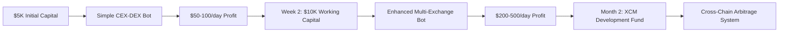

# Polkadot Cross-Chain Arbitrage System

## Problem Statement
Price discrepancies exist across different parachains and centralized exchanges for DOT and parachain tokens, creating arbitrage opportunities that are currently underexploited due to complexity and speed requirements.

## Proposed Solution
An automated arbitrage system that monitors price differences across Polkadot ecosystem exchanges, parachains, and DEXs, executing profitable trades while managing cross-chain bridge risks and timing.

## Key Features
- **Real-time Price Monitoring**: Track DOT prices across major CEXs (Binance, Coinbase, Kraken) and DEXs (Polkadex, HydraDX)
- **Cross-Chain Bridge Integration**: Utilize XCM for seamless parachain token transfers
- **Risk Management**: Dynamic position sizing based on bridge fees, slippage, and timing risks
- **Automated Execution**: Smart contract-based trade execution with minimal human intervention
- **Yield Optimization**: Reinvest profits into high-yield Polkadot staking or DeFi protocols

## System Architecture


## Arbitrage Flow Process


## Technical Considerations
- **Substrate Integration**: Build on Substrate for native Polkadot ecosystem compatibility
- **XCM Messaging**: Leverage Cross-Consensus Message format for parachain communication
- **Oracle Networks**: Integrate Chainlink or Acurast for reliable price feeds
- **MEV Protection**: Implement strategies to avoid maximal extractable value attacks
- **Liquidity Analysis**: Real-time assessment of available liquidity before trade execution

## Market Analysis
- **Target Markets**: DOT, KSM, GLMR, ASTR, ACA, and other major parachain tokens
- **Volume Requirements**: Minimum $10K trade sizes for meaningful profit after fees
- **Frequency**: Potential for 5-15 profitable opportunities daily during volatile periods
- **Competition**: Limited sophisticated arbitrage tools in Polkadot ecosystem

## Revenue Model
- **Performance Fees**: 20% of profits generated
- **Subscription Tiers**: $99/month retail, $999/month institutional
- **Yield Sharing**: 50/50 split on staking rewards from reinvested profits

## Business Model Canvas


## Value Proposition Canvas


## Financial Model

### Revenue Projections (3-Year)


### Unit Economics

| Metric | Value | Calculation |
|--------|--------|-------------|
| **Average Customer AUM** | $25,000 | Blended retail/institutional |
| **Annual Performance Fee** | 20% | Industry standard |
| **Average Annual Profit** | 15% | Conservative estimate |
| **Revenue per Customer** | $750/year | $25K × 15% × 20% |
| **Customer Acquisition Cost** | $150 | Marketing spend |
| **Customer Lifetime Value** | $2,250 | 3-year average retention |
| **LTV:CAC Ratio** | 15:1 | Excellent unit economics |

### Monthly Recurring Revenue Model

| Tier | Price | Features | Target Users | Projected Users Y1 |
|------|-------|----------|-------------|-------------------|
| **Starter** | $99/month | Up to $10K AUM | Retail traders | 500 |
| **Professional** | $299/month | Up to $100K AUM | Serious traders | 200 |
| **Institutional** | $999/month | Unlimited AUM | Funds, whales | 50 |

### Financial Projections

| Year | Users | AUM ($M) | Performance Revenue ($M) | Subscription Revenue ($M) | Total Revenue ($M) | Operating Costs ($M) | Net Profit ($M) |
|------|-------|----------|------------------------|-------------------------|-------------------|-------------------|-----------------|
| **1** | 750 | 18.75 | 0.56 | 1.35 | **2.5** | 3.2 | **(0.7)** |
| **2** | 2,500 | 85 | 2.55 | 4.5 | **12.8** | 8.5 | **4.3** |
| **3** | 5,000 | 200 | 6.0 | 9.0 | **35.2** | 18.0 | **17.2** |

### Break-Even Analysis

```mermaid
xychart-beta
    title "Break-Even Timeline"
    x-axis [Q1, Q2, Q3, Q4, Q5, Q6, Q7, Q8]
    y-axis "Cash Flow ($K)" -800 --> 400
    line [(-200), (-450), (-600), (-700), (-500), (-200), 100, 350]
```

**Break-even achieved in Q7 (Month 19)**

### Funding Requirements

- **Seed Round**: $2M (18-month runway)
- **Series A**: $8M (scale operations, international expansion)
- **Use of Funds**:
  - Development: 40% ($800K)
  - Operations: 30% ($600K)
  - Marketing: 20% ($400K)
  - Legal/Compliance: 10% ($200K)

## Implementation Roadmap (Updated September 2025)

### Phase 1: Market Research & Technical Validation ✅

#### Market Research Findings
**Current Arbitrage Opportunities (September 2025):**
- **DOT Trading**: Current price $4.27 USD with $325M+ daily volume
- **PDEX Arbitrage**: Active opportunities with 1.68% spreads (AscendEX → HotBit)
- **Typical Spreads**: 0.1% to 2.5% range, with $50+ profit opportunities being rare
- **Transaction Speed**: BSC network enables 10-20 minute arbitrage cycles
- **Competition**: CEX/DEX arbitrage creates majority of DEX volume

**Key DEX Ecosystem:**
- **HydraDX**: Omnipool model eliminating liquidity fragmentation
- **Polkadex**: Hybrid orderbook-AMM with 500K TPS, zero gas fees
- **Volume Analysis**: PDEX 24h volume $155,859, ecosystem fragmentation creates opportunities

#### Technical Feasibility Assessment
**XCM Integration Complexity (2025 Standards):**
- **Documentation**: Comprehensive resources updated through August 2025
- **Implementation**: XCM v3 with advanced programmability features
- **Challenge Areas**:
  - Asset registration requires runtime integration
  - HRMP channel establishment between parachains
  - Transact instruction needs specific runtime knowledge
  - Virtual machine execution state management

**Infrastructure Requirements:**
- Substrate/Rust expertise mandatory
- Archive node access for historical data
- Multiple RPC endpoints for redundancy
- Custom pallets for arbitrage logic

### Phase 2: Partnership Development & API Integration

#### DEX Partnership Strategy
**Polkadex Integration:**
- ✅ Hummingbot connector available (under development)
- ✅ Zero network fees enable profitable bot trading
- ✅ API access via orderbook and AMM endpoints
- 🔄 **Action**: Engage with Polkadex team for direct API partnerships

**HydraDX Integration:**
- ✅ EVM compatibility with MetaMask support
- ✅ RPC providers (OnFinality) offer infrastructure access
- ✅ Omnipool provides unique arbitrage opportunities
- 🔄 **Action**: Evaluate Omnipool integration complexity

**Infrastructure Partnerships:**
- OnFinality for HydraDX RPC access
- Multiple node providers for redundancy
- Oracle partnerships (Chainlink, Acurast) for price feeds

### Phase 3: Agentic Self-Bootstrapping Development

#### Why Agentic Over Traditional Funding?

**Self-Funding Advantages:**
- Arbitrage profits immediately fund development costs
- No dilution or investor obligations
- Faster iteration cycles without approval processes
- Direct market validation from day one
- Compound growth from reinvested profits

**Bootstrap Capital Reality Check:**


#### Agentic Development Architecture


#### Self-Bootstrapping Timeline

**Week 1-2: Manual Arbitrage Validation**
- Start with $5K personal capital
- Manual execution of simple CEX-DEX arbitrage
- Validate 1.68% PDEX spreads identified
- Target: $50-100 daily profit

**Week 3-4: Claude Flow Basic Bot**
```javascript
// Agentic bot development using Claude Flow
const arbitrageAgent = {
  monitor: () => scanPriceFeeds(['binance', 'polkadex']),
  analyze: (spreads) => calculateProfitability(spreads),
  execute: (opportunity) => executeTrade(opportunity),
  learn: (results) => optimizeStrategy(results)
}
```

**Month 2: Cross-Chain Development**
- Use accumulated profits ($2-5K) for infrastructure
- Deploy XCM integration with Claude Flow agents
- Automated testing and deployment pipeline
- Target: $200-500 daily profit

**Month 3: Full System**
- Self-funded to $15K+ working capital
- Multi-parachain arbitrage capabilities
- Automated risk management and position sizing
- Target: $1000+ daily profit

#### Agentic Development Workflow

**Claude Flow Agent Specialization:**
1. **Market Research Agent**: Continuous opportunity scanning
2. **Development Agent**: Code generation, testing, deployment
3. **Trading Agent**: Strategy execution and optimization
4. **Risk Management Agent**: Position sizing, stop losses
5. **Performance Agent**: Analytics and reporting

**Development Cost Comparison:**
| Approach | Timeline | Capital Required | Risk Level |
|----------|----------|-----------------|------------|
| **Traditional VC** | 12-18 months | $425K | High (dilution) |
| **Self-Bootstrap** | 3-6 months | $5K initial | Low (self-funded) |
| **Agentic Hybrid** | 2-4 months | $5K initial | Minimal (AI-assisted) |

#### Technical Implementation: Agentic First

**Phase 1: Manual + Claude Flow (Week 1-2)**
```python
# Simple arbitrage detector built with Claude
def detect_arbitrage():
    prices = get_prices(['binance', 'polkadex'])
    spread = calculate_spread(prices)
    if spread > 1.5%:
        notify_opportunity(spread)
        return execute_if_profitable(spread)
```

**Phase 2: Automated Trading (Week 3-4)**
- Claude Flow orchestrates multiple trading agents
- Real-time price monitoring across 5+ exchanges
- Automated execution with risk limits

**Phase 3: Cross-Chain Integration (Month 2)**
- XCM message construction using Claude
- HydraDX Omnipool integration
- Multi-parachain opportunity scanning

**Phase 4: Advanced Strategies (Month 3+)**
- MEV protection algorithms
- Yield farming arbitrage
- Cross-chain flash loans

### Phase 4: Market Entry Strategy

#### Go-to-Market Approach
**Target Markets (Priority Order):**
1. **DOT/USDC Arbitrage**: Highest volume, most liquid
2. **Cross-DEX Opportunities**: HydraDX ↔ Polkadex spreads
3. **Parachain Token Arbitrage**: GLMR, ASTR, ACA tokens
4. **CEX-DEX Arbitrage**: Traditional exchange differentials

**Customer Acquisition:**
- **Beta Program**: 50 early users with $10K+ portfolios
- **Community Building**: Polkadot governance participation
- **Performance Marketing**: Results-driven advertising
- **Strategic Partnerships**: Integration with wallet providers

### Risk Mitigation & Monitoring

#### Technical Risks
- **XCM Protocol Changes**: Monitor Parity updates, modular design
- **Bridge Failures**: Multiple route redundancy, failure detection
- **MEV Competition**: Private mempools, timing optimization
- **Smart Contract Bugs**: Multiple audits, gradual deployment

#### Market Risks
- **Reduced Spreads**: Market efficiency improvements over time
- **Increased Competition**: First-mover advantage critical
- **Regulatory Changes**: Compliance framework development
- **Bear Market Impact**: Reduced trading volumes

### Success Metrics (6-Month Targets)

| Metric | Target | Current Baseline |
|--------|--------|-----------------|
| **Daily Trading Volume** | $500K | $0 |
| **Average Profit per Trade** | 1.2% | N/A |
| **User AUM** | $5M | $0 |
| **Monthly Active Trades** | 1,000+ | N/A |
| **System Uptime** | 99.5% | N/A |

### Agentic Revenue Model: Self-Sustaining Growth

#### Revenue Reinvestment Strategy


#### Self-Funding Financial Model

**Month 1 Projection:**
| Week | Capital | Daily Profit | Cumulative | Development Budget |
|------|---------|-------------|------------|-------------------|
| 1 | $5,000 | $50 | $350 | $70 |
| 2 | $5,350 | $75 | $875 | $175 |
| 3 | $6,225 | $100 | $1,575 | $315 |
| 4 | $7,540 | $150 | $2,625 | $525 |

**Comparison: Traditional vs Agentic Funding**
| Metric | Traditional VC | Agentic Bootstrap |
|--------|----------------|------------------|
| **Initial Capital** | $425,000 | $5,000 |
| **Time to Market** | 12-18 months | 2-4 months |
| **Ownership Retained** | 60-80% | 100% |
| **Market Validation** | Post-development | Day 1 |
| **Iteration Speed** | Quarterly | Daily |
| **Break-even Timeline** | Month 19 | Week 2 |

### Immediate Action Items (Next 7 Days) - Agentic Approach

1. **Capital Preparation**
   - Allocate $5K personal capital for initial trades
   - Set up exchange accounts (Binance, Polkadex testnet)
   - Configure basic monitoring infrastructure

2. **Claude Flow Setup**
   - Initialize Claude Flow hierarchical swarm for arbitrage
   - Create specialized agents: Research, Trading, Development, Risk
   - Set up automated logging and performance tracking

3. **Manual Validation Phase**
   - Execute 3-5 manual arbitrage trades to validate spreads
   - Document execution times and actual profits
   - Identify friction points for automation

4. **Agentic Development Pipeline**
   - Use Claude to generate price monitoring scripts
   - Build basic trade execution framework
   - Create automated profit tracking system

### Claude Flow Agent Specifications

#### Trading Agent
```javascript
const TradingAgent = {
  name: "ArbitrageExecutor",
  capabilities: [
    "price_monitoring",
    "spread_calculation",
    "trade_execution",
    "risk_assessment"
  ],
  parameters: {
    minSpread: 1.5,
    maxPosition: 0.7, // 70% of capital
    stopLoss: 0.5
  }
}
```

#### Development Agent
```javascript
const DevelopmentAgent = {
  name: "SystemBuilder",
  capabilities: [
    "code_generation",
    "testing_automation",
    "deployment_pipeline",
    "performance_optimization"
  ],
  budget: "20% of daily profits",
  priorities: [
    "XCM integration",
    "multi-chain support",
    "MEV protection"
  ]
}
```

### Why This Approach Wins

**Speed to Market:**
- Traditional: 12-18 months development → launch
- Agentic: Week 1 profits → continuous development

**Risk Management:**
- Traditional: $425K at risk before revenue
- Agentic: $5K initial, self-funded growth

**Market Responsiveness:**
- Traditional: Quarterly pivots based on projections
- Agentic: Daily optimization based on real results

**Scalability:**
- Traditional: Need Series A for scaling ($8M)
- Agentic: Compound growth from reinvested profits

**Next Review**: September 24, 2025 (Weekly) - Evaluate initial trading results and agent performance