# Polkadot Arbitrage Agent - Personal Project

## Problem Statement
Michael and Bruno have identified arbitrage opportunities across Polkadot ecosystem exchanges but manual execution is time-intensive and error-prone. We need an intelligent agent to automate this process using our own capital.

## Proposed Solution
A collaborative development project to build a personal arbitrage agent that Michael and Bruno can each run independently using their own funds. Shared codebase, individual operation, no commercial intent - just a smart tool for personal trading optimization.

## Key Features
- **Collaborative Development**: Michael and Bruno share code development and strategy insights
- **Independent Operation**: Each person runs their own instance with personal capital and API keys
- **Real-time Price Monitoring**: Track DOT prices across major CEXs and DEXs (Polkadex, HydraDX)
- **Cross-Chain Integration**: Utilize XCM for seamless parachain arbitrage opportunities
- **Claude Flow AI**: Intelligent agents that learn and optimize trading strategies over time
- **Zero-Fee Strategy**: PDEX staking and Polkadot native ecosystem focus to minimize costs
- **Shared Learning**: Both instances contribute to strategy optimization and market insights

## System Architecture


## Arbitrage Flow Process


## Technical Considerations
- **Substrate Integration**: Build on Substrate for native Polkadot ecosystem compatibility
- **XCM Messaging**: Leverage Cross-Consensus Message format for parachain communication
- **Oracle Networks**: Integrate Chainlink or Acurast for reliable price feeds
- **MEV Protection**: Implement strategies to avoid maximal extractable value attacks
- **Liquidity Analysis**: Real-time assessment of available liquidity before trade execution

## Personal Trading Opportunity Analysis


## Personal Project Goals
- **Michael's Goal**: Generate $1K+/month passive income from $10K+ capital
- **Bruno's Goal**: Learn AI-powered trading while building personal wealth
- **Shared Goal**: Create reusable arbitrage infrastructure for future projects

## Project Structure - Michael & Bruno Collaboration


## Personal Project Benefits - Michael & Bruno


## Complete Cost & Return Analysis - Personal Collaboration

### Individual Investment Breakdown


### Detailed Cost Analysis (Per Person)


### Personal Return Projections


### Monthly P&L Projection (Individual)

```mermaid
gantt
    title Personal Monthly Returns Timeline
    dateFormat YYYY-MM
    axisFormat %b

    section Capital Growth
    $1K → $1.5K (Month 1)     :done, 2025-09, 30d
    $1.5K → $2.5K (Month 2)   :active, 2025-10, 30d
    $2.5K → $4.5K (Month 3)   :2025-11, 30d
    $4.5K → $7.9K (Month 4)   :2025-12, 30d
    $7.9K → $13K (Month 5)    :2026-01, 30d
    $13K → $22K (Month 6)     :2026-02, 30d
    $22K → $35K (Month 8)     :2026-04, 60d
    $35K → $61K (Month 12)    :2026-08, 120d

    section Development Milestones
    Basic Bot Complete        :milestone, 2025-11, 0d
    XCM Integration           :milestone, 2026-01, 0d
    Full Automation          :milestone, 2026-04, 0d
```



### Detailed Monthly Breakdown (Per Person)

| Month | Capital | Daily Profit | Monthly Costs | Net Profit | Ending Capital | ROI % |
|-------|---------|-------------|---------------|------------|----------------|-------|
| **1** | $1,000 | $15 | $75 | $375 | $1,450 | 45% |
| **2** | $1,450 | $35 | $75 | $975 | $2,510 | 73% |
| **3** | $2,510 | $65 | $75 | $1,940 | $4,490 | 83% |
| **4** | $4,490 | $110 | $75 | $3,335 | $7,855 | 79% |
| **5** | $7,855 | $180 | $75 | $5,505 | $13,380 | 73% |
| **6** | $13,380 | $280 | $75 | $8,605 | $21,995 | 67% |
| **7** | $21,995 | $420 | $75 | $12,945 | $28,540 | 61% |
| **8** | $28,540 | $550 | $75 | $16,975 | $35,215 | 63% |
| **9** | $35,215 | $680 | $75 | $21,005 | $41,820 | 62% |
| **10** | $41,820 | $810 | $75 | $25,035 | $48,355 | 61% |
| **11** | $48,355 | $940 | $75 | $29,065 | $54,920 | 61% |
| **12** | $54,920 | $1,070 | $75 | $33,095 | $61,415 | 61% |

### No Commercial Revenue Model - Pure Personal Use

**Project Investment Approach:**
- Each person invests their own $1K trading capital
- Shared development time and expertise
- No commercial licensing or sales
- Value creation through personal trading profits
- Open source collaboration for learning

### Development Funding Strategy


**Sustainable Development Loop:**
- Trading profits fund infrastructure costs
- Success motivates continued development
- Shared learning accelerates both instances
- No external dependencies or obligations

### Risk Analysis - Personal Project

| Risk | Impact | Probability | Mitigation |
|------|--------|-------------|------------|
| **Individual Capital Loss** | Medium | Low | Start small ($1K), good risk management |
| **Time Investment** | Low | Medium | 20hrs/week sustainable for side project |
| **Technical Complexity** | Medium | Medium | Collaborative development reduces risk |
| **Market Changes** | Low | High | Adaptable strategies, continuous learning |

### Legal Structure - Ultra Simple


**Legal Benefits:**
- No business registration required
- No commercial compliance
- Personal capital gains treatment
- No regulatory oversight needed

## Implementation Roadmap (Updated September 2025)

### Phase 1: Market Research & Technical Validation ✅

#### Market Research Findings
**Current Arbitrage Opportunities (September 2025):**
- **DOT Trading**: Current price $4.27 USD with $325M+ daily volume
- **PDEX Arbitrage**: Active opportunities with 1.68% spreads (AscendEX → HotBit)
- **Typical Spreads**: 0.1% to 2.5% range, with $50+ profit opportunities being rare
- **Transaction Speed**: BSC network enables 10-20 minute arbitrage cycles
- **Competition**: CEX/DEX arbitrage creates majority of DEX volume

**Key DEX Ecosystem:**
- **HydraDX**: Omnipool model eliminating liquidity fragmentation
- **Polkadex**: Hybrid orderbook-AMM with 500K TPS, zero gas fees
- **Volume Analysis**: PDEX 24h volume $155,859, ecosystem fragmentation creates opportunities

#### Technical Feasibility Assessment
**XCM Integration Complexity (2025 Standards):**
- **Documentation**: Comprehensive resources updated through August 2025
- **Implementation**: XCM v3 with advanced programmability features
- **Challenge Areas**:
  - Asset registration requires runtime integration
  - HRMP channel establishment between parachains
  - Transact instruction needs specific runtime knowledge
  - Virtual machine execution state management

**Infrastructure Requirements:**
- Substrate/Rust expertise mandatory
- Archive node access for historical data
- Multiple RPC endpoints for redundancy
- Custom pallets for arbitrage logic

### Phase 2: Partnership Development & API Integration

#### DEX Partnership Strategy
**Polkadex Integration:**
- ✅ Hummingbot connector available (under development)
- ✅ Zero network fees enable profitable bot trading
- ✅ API access via orderbook and AMM endpoints
- 🔄 **Action**: Engage with Polkadex team for direct API partnerships

**HydraDX Integration:**
- ✅ EVM compatibility with MetaMask support
- ✅ RPC providers (OnFinality) offer infrastructure access
- ✅ Omnipool provides unique arbitrage opportunities
- 🔄 **Action**: Evaluate Omnipool integration complexity

**Infrastructure Partnerships:**
- OnFinality for HydraDX RPC access
- Multiple node providers for redundancy
- Oracle partnerships (Chainlink, Acurast) for price feeds

### Phase 3: Agentic Self-Bootstrapping Development

#### Why Agentic Over Traditional Funding?

**Self-Funding Advantages:**
- Arbitrage profits immediately fund development costs
- No dilution or investor obligations
- Faster iteration cycles without approval processes
- Direct market validation from day one
- Compound growth from reinvested profits

**Realistic Bootstrap Capital ($1K Start):**


#### Agentic Development Architecture


#### Comprehensive Fee Analysis & Zero-Fee Strategy


#### Monthly Financial Projections ($1K Start)


#### Detailed Monthly Breakdown

**Month 1: Manual Validation ($1,000 → $1,500)**


| Week | Capital | Avg Daily Profit | Weekly Profit | Cumulative | Fees Paid |
|------|---------|------------------|---------------|------------|-----------|
| 1 | $1,000 | $12 | $84 | $1,084 | $2 |
| 2 | $1,084 | $15 | $105 | $1,189 | $3 |
| 3 | $1,189 | $18 | $126 | $1,315 | $4 |
| 4 | $1,315 | $22 | $154 | $1,469 | $5 |

**Month 2: Basic Automation ($1,500 → $2,800)**


| Week | Capital | Avg Daily Profit | Weekly Profit | Cumulative | Development Cost |
|------|---------|------------------|---------------|------------|------------------|
| 5 | $1,469 | $28 | $196 | $1,665 | $50 |
| 6 | $1,665 | $35 | $245 | $1,910 | $60 |
| 7 | $1,910 | $42 | $294 | $2,204 | $70 |
| 8 | $2,204 | $50 | $350 | $2,554 | $80 |

**Month 3: Enhanced Strategies ($2,800 → $5,500)**


**Month 4-6: Cross-Chain Integration ($5,500 → $25,000)**


#### Agentic Development Workflow

**Claude Flow Agent Specialization:**
1. **Market Research Agent**: Continuous opportunity scanning
2. **Development Agent**: Code generation, testing, deployment
3. **Trading Agent**: Strategy execution and optimization
4. **Risk Management Agent**: Position sizing, stop losses
5. **Performance Agent**: Analytics and reporting

**Development Cost Comparison:**
| Approach | Timeline | Capital Required | Risk Level |
|----------|----------|-----------------|------------|
| **Traditional VC** | 12-18 months | $425K | High (dilution) |
| **Self-Bootstrap** | 3-6 months | $5K initial | Low (self-funded) |
| **Agentic Hybrid** | 2-4 months | $5K initial | Minimal (AI-assisted) |

#### Technical Implementation: Agentic First

**Phase 1: Manual + Claude Flow (Week 1-2)**
```python
# Simple arbitrage detector built with Claude
def detect_arbitrage():
    prices = get_prices(['binance', 'polkadex'])
    spread = calculate_spread(prices)
    if spread > 1.5%:
        notify_opportunity(spread)
        return execute_if_profitable(spread)
```

**Phase 2: Automated Trading (Week 3-4)**
- Claude Flow orchestrates multiple trading agents
- Real-time price monitoring across 5+ exchanges
- Automated execution with risk limits

**Phase 3: Cross-Chain Integration (Month 2)**
- XCM message construction using Claude
- HydraDX Omnipool integration
- Multi-parachain opportunity scanning

**Phase 4: Advanced Strategies (Month 3+)**
- MEV protection algorithms
- Yield farming arbitrage
- Cross-chain flash loans

### Phase 4: Market Entry Strategy

#### Go-to-Market Approach
**Target Markets (Priority Order):**
1. **DOT/USDC Arbitrage**: Highest volume, most liquid
2. **Cross-DEX Opportunities**: HydraDX ↔ Polkadex spreads
3. **Parachain Token Arbitrage**: GLMR, ASTR, ACA tokens
4. **CEX-DEX Arbitrage**: Traditional exchange differentials

**Customer Acquisition:**
- **Beta Program**: 50 early users with $10K+ portfolios
- **Community Building**: Polkadot governance participation
- **Performance Marketing**: Results-driven advertising
- **Strategic Partnerships**: Integration with wallet providers

### Risk Mitigation & Monitoring

#### Technical Risks
- **XCM Protocol Changes**: Monitor Parity updates, modular design
- **Bridge Failures**: Multiple route redundancy, failure detection
- **MEV Competition**: Private mempools, timing optimization
- **Smart Contract Bugs**: Multiple audits, gradual deployment

#### Market Risks
- **Reduced Spreads**: Market efficiency improvements over time
- **Increased Competition**: First-mover advantage critical
- **Regulatory Changes**: Compliance framework development
- **Bear Market Impact**: Reduced trading volumes

### Success Metrics (6-Month Targets)

| Metric | Target | Current Baseline |
|--------|--------|-----------------|
| **Daily Trading Volume** | $500K | $0 |
| **Average Profit per Trade** | 1.2% | N/A |
| **User AUM** | $5M | $0 |
| **Monthly Active Trades** | 1,000+ | N/A |
| **System Uptime** | 99.5% | N/A |

### Agentic Revenue Model: Self-Sustaining Growth

#### Revenue Reinvestment Strategy


#### Complete 12-Month Financial Model ($1K → $50K+)

**Zero-Fee Strategy Implementation:**
```mermaid
graph TD
    A[Month 1: Stake PDEX] --> B[Zero Trading Fees Activated]
    B --> C[Focus on Polkadot Ecosystem]
    C --> D[Minimal Network Fees Only]
    D --> E[Fee Savings = Extra Profit]
    E --> F[Compound Growth Acceleration]
```

**Comprehensive Monthly Projections:**
| Month | Starting Capital | Avg Daily Profit | Monthly Profit | Total Fees | Net Growth | Ending Capital |
|-------|------------------|------------------|----------------|------------|------------|----------------|
| **1** | $1,000 | $15 | $465 | $15 | $450 | $1,450 |
| **2** | $1,450 | $35 | $1,085 | $25 | $1,060 | $2,510 |
| **3** | $2,510 | $65 | $2,015 | $35 | $1,980 | $4,490 |
| **4** | $4,490 | $110 | $3,410 | $45 | $3,365 | $7,855 |
| **5** | $7,855 | $180 | $5,580 | $55 | $5,525 | $13,380 |
| **6** | $13,380 | $280 | $8,680 | $65 | $8,615 | $21,995 |
| **7** | $21,995 | $420 | $13,020 | $75 | $12,945 | $34,940 |
| **8** | $34,940 | $600 | $18,600 | $85 | $18,515 | $53,455 |
| **9** | $53,455 | $800 | $24,800 | $95 | $24,705 | $78,160 |
| **10** | $78,160 | $1,000 | $31,000 | $105 | $30,895 | $109,055 |
| **11** | $109,055 | $1,200 | $37,200 | $115 | $37,085 | $146,140 |
| **12** | $146,140 | $1,400 | $43,400 | $125 | $43,275 | $189,415 |

**Fee Minimization Strategies:**
```mermaid
flowchart TD
    subgraph "Zero-Fee Ecosystem"
        A[PDEX Staking] --> B[0% Trading Fees on Polkadex]
        C[Native Polkadot] --> D[Minimal Gas ~$0.01]
        E[XCM Integration] --> F[Direct Parachain Access]
    end

    subgraph "Fee Comparison"
        G[Traditional CEX] --> H[0.1% per trade]
        I[Ethereum DEX] --> J[$20-50 gas fees]
        K[Our Strategy] --> L[<0.01% total cost]
    end

    B --> M[Net Profit Increase]
    D --> M
    F --> M
```

**Return on Investment Analysis:**
| Timeframe | Investment | Return | ROI | Annualized ROI |
|-----------|------------|--------|-----|----------------|
| **Month 3** | $1,000 | $3,490 | 349% | 1,396% |
| **Month 6** | $1,000 | $20,995 | 2,100% | 4,200% |
| **Month 12** | $1,000 | $188,415 | 18,842% | 18,842% |

**Risk-Adjusted Projections (Conservative Scenario):**
```mermaid
xychart-beta
    title "Growth Scenarios: Conservative vs Optimistic"
    x-axis [M1, M2, M3, M4, M5, M6, M7, M8, M9, M10, M11, M12]
    y-axis "Capital ($K)" 0 --> 200
    line [1.2, 2.0, 3.2, 5.5, 8.5, 13.0, 19.5, 28.0, 39.0, 52.5, 68.5, 87.0]
    line [1.5, 2.5, 4.5, 7.9, 13.4, 22.0, 34.9, 53.5, 78.2, 109.1, 146.1, 189.4]
```

**Approach Comparison: Commercial vs Personal Project**
| Metric | Commercial Software | Personal Collaboration Project |
|--------|-------------------|------------------------------|
| **Legal Complexity** | Business registration, licensing | No business entity required |
| **Revenue Model** | Software sales, subscriptions | Personal trading profits only |
| **Customer Support** | Documentation, help desk | Peer collaboration and learning |
| **Development Pressure** | Market deadlines, user demands | Personal timeline, learning focus |
| **Risk** | Business failure, market competition | Individual capital risk only |
| **Scalability** | Global commercial distribution | Limited to Michael and Bruno |
| **Focus** | Product-market fit, sales | Personal optimization, education |
| **Value Creation** | Software licensing revenue | Trading profits + knowledge |

### Fee-Optimized Implementation Strategy

#### Can It Be Done Without Fees? YES!
```mermaid
graph LR
    subgraph "Zero-Fee Path"
        A[Stake PDEX Tokens] --> B[0% Trading Fees]
        C[Use Native Polkadot] --> D[~$0.01 Network Fees]
        E[XCM Direct Routes] --> F[No Bridge Fees]
        G[Smart Position Sizing] --> H[Fees < 0.01% of trades]
    end

    subgraph "Fee Avoidance"
        I[Avoid Ethereum] --> J[No $20-50 gas fees]
        K[Avoid CEX Withdrawals] --> L[No $5-10 fixed fees]
        M[Batch Operations] --> N[Minimize TX count]
    end

    B --> O[Maximum Profit Retention]
    D --> O
    F --> O
    H --> O
    J --> O
    L --> O
    N --> O
```

#### Immediate Action Items (Next 7 Days) - $1K Bootstrap

**Day 1-2: Setup & Staking**
```mermaid
flowchart TD
    A[Day 1: Allocate $1K] --> B[Buy PDEX tokens]
    B --> C[Stake PDEX for zero fees]
    C --> D[Set up Polkadex account]
    D --> E[Configure price monitoring]
    E --> F[Ready for manual trading]
```

1. **Capital Preparation**
   - Allocate $1K personal capital for initial trades
   - Purchase PDEX tokens for staking (zero trading fees)
   - Set up accounts: Polkadex (zero gas), HydraDX, Binance
   - Configure basic monitoring infrastructure

2. **Zero-Fee Activation**
   - Stake PDEX to unlock zero trading fees
   - Test Polkadex orderbook and AMM functionality
   - Verify zero gas fee transactions
   - Document actual fee structure

3. **Manual Validation Phase**
   - Execute 3-5 manual arbitrage trades
   - Target: 1.5%+ spreads, $10-20 daily profit
   - Track actual fees vs projected (should be near zero)
   - Document execution times and friction points

4. **Claude Flow Preparation**
   - Set up Claude Flow environment for arbitrage agents
   - Design agent architecture for price monitoring
   - Create basic trade execution framework
   - Plan automated profit tracking system

#### Weekly Milestones ($1K Start)

**Week 1: Manual Validation ($1,000 → $1,150)**
- Prove zero-fee strategy works
- Achieve $10-20 daily profit manually
- Document best opportunities and timing
- Prepare automation specifications

**Week 2: Basic Automation ($1,150 → $1,350)**
- Deploy Claude Flow price monitoring
- Automate trade execution with risk limits
- Target $25-35 daily profit
- Begin development fund accumulation

**Week 3-4: Enhanced Strategy ($1,350 → $1,750)**
- Multi-pair arbitrage opportunities
- Cross-parachain price monitoring
- Target $40-60 daily profit
- Fund XCM development research

## DOT vs USDC: Which Asset Offers Better Arbitrage Opportunities?

### Comparing Arbitrage Characteristics: DOT vs USDC

Let's analyze whether DOT or USDC provides superior arbitrage opportunities for personal trading:

#### DOT Arbitrage Characteristics

```mermaid
graph TB
    subgraph "DOT Advantages"
        A[High Volatility<br/>2-5% daily swings] --> B[Frequent price gaps]
        C[Native Polkadot Ecosystem<br/>Zero gas fees] --> D[Low execution costs]
        E[Multiple DEX Options<br/>Polkadex, HydraDX, Moonbeam] --> F[Price fragmentation]
        G[Large CEX Presence<br/>Binance, Coinbase, Kraken] --> H[CEX-DEX spreads]
    end

    subgraph "DOT Challenges"
        I[Price Volatility Risk<br/>Position value changes] --> J[Timing sensitive]
        K[Liquidity Variations<br/>DEX pools smaller] --> L[Slippage risk]
        M[Market Correlation<br/>Crypto market movements] --> N[Systematic risk]
    end

    B --> O[Arbitrage Opportunity]
    D --> O
    F --> O
    H --> O
    J --> P[Risk Management Needed]
    L --> P
    N --> P
```

#### USDC Arbitrage Characteristics

```mermaid
graph TB
    subgraph "USDC Advantages"
        A[Price Stability<br/>~$1.00 target] --> B[Predictable arbitrage]
        C[High Liquidity<br/>$6B+ daily volume] --> D[Minimal slippage]
        E[Cross-Chain Presence<br/>Ethereum, Polygon, Solana] --> F[Cross-chain opportunities]
        G[Regulatory Clarity<br/>Stable regulatory status] --> H[Lower regulatory risk]
    end

    subgraph "USDC Challenges"
        I[Smaller Spreads<br/>0.01-0.5% typical] --> J[Lower profit margins]
        K[High Competition<br/>Institutional bots] --> L[Rapid arbitrage closure]
        M[Depeg Risk<br/>Rare but significant] --> N[Black swan events]
    end

    B --> O[Consistent Small Gains]
    D --> O
    F --> O
    H --> O
    J --> P[Volume Requirements]
    L --> P
    N --> P
```

#### Head-to-Head Comparison

| Metric | DOT Arbitrage | USDC Arbitrage | Winner |
|--------|---------------|----------------|--------|
| **Average Spread Size** | 0.5-3.0% | 0.01-0.5% | 🏆 DOT |
| **Frequency of Opportunities** | 10-15/day | 50-100/day | 🏆 USDC |
| **Execution Speed Required** | Medium (5-30 min) | Fast (<2 min) | 🏆 DOT |
| **Capital Requirements** | $1K+ effective | $50K+ for meaningful profit | 🏆 DOT |
| **Risk Level** | Medium-High | Low | 🏆 USDC |
| **Profit Potential** | High ($20-200/day on $1K) | Low ($2-10/day on $1K) | 🏆 DOT |
| **Competition Level** | Medium | Very High | 🏆 DOT |
| **Technical Complexity** | Medium | Low | 🏆 USDC |

#### Verdict for Personal Trading ($1K-$10K Capital)

```mermaid
flowchart TD
    A[Capital: $1K-$10K] --> B{Strategy Choice}

    B -->|DOT Arbitrage| C[Higher Risk, Higher Reward]
    B -->|USDC Arbitrage| D[Lower Risk, Lower Reward]

    C --> E[2-5 trades/day]
    C --> F[1.5-3.0% profit per trade]
    C --> G[$20-60 daily profit potential]

    D --> H[20-50 trades/day]
    D --> I[0.01-0.3% profit per trade]
    D --> J[$2-15 daily profit potential]

    G --> K[🏆 Better for Small Capital]
    J --> L[Requires Large Capital]

    K --> M[DOT Recommended for Michael & Bruno]
```

#### Why DOT Wins for Personal Trading

**Capital Efficiency:**
- **DOT**: $1K can generate $20-60/day (2-6% daily return)
- **USDC**: $1K generates $2-10/day (0.2-1% daily return)
- **Conclusion**: DOT provides 3-10x better returns on small capital

**Opportunity Windows:**
```mermaid
xychart-beta
    title "Daily Profit Potential Comparison ($1K capital)"
    x-axis [Week-1, Week-2, Week-3, Week-4]
    y-axis "Daily Profit ($)" 0 --> 60
    line [15, 25, 35, 45]
    line [3, 5, 7, 8]
```

**Risk vs Reward Analysis:**

| Factor | DOT | USDC | Personal Trading Impact |
|--------|-----|------|------------------------|
| **Volatility Risk** | High (asset price changes during arbitrage) | Very Low (stable $1.00) | DOT requires faster execution |
| **Profit Margins** | 1.5-3.0% per trade | 0.01-0.5% per trade | DOT: 6x higher profit per trade |
| **Capital Efficiency** | High (meaningful profits on $1K) | Low (need $50K+ for good returns) | DOT: Perfect for personal scale |
| **Market Access** | Good (native Polkadot ecosystem) | Excellent (everywhere) | DOT: Optimized for zero-fee strategy |

#### Strategic Recommendation for Michael & Bruno

```mermaid
flowchart TD
    A[Start with DOT Arbitrage] --> B[Reasons for DOT Focus]

    B --> C[Capital Efficiency<br/>Better returns on $1K]
    B --> D[Polkadot Ecosystem<br/>Zero-fee advantage]
    B --> E[Learning Opportunity<br/>Volatility teaches risk mgmt]
    B --> F[Growth Potential<br/>Scale to larger capital]

    C --> G[Monthly Target: $600+]
    D --> H[Keep 95%+ of profits]
    E --> I[Build trading skills]
    F --> J[Reinvest for compound growth]

    G --> K[Proven Strategy Success]
    H --> K
    I --> K
    J --> K

    K --> L[Later: Add USDC for Stability]
```

#### USDC: When to Consider It

**USDC becomes attractive when:**
- **Capital reaches $50K+**: Higher capital makes small spreads meaningful
- **Risk tolerance decreases**: Stable strategy for capital preservation
- **Market volatility is extreme**: Flight to stability during crashes
- **Portfolio diversification needed**: Complement to DOT volatility

#### Final Verdict: DOT for Bootstrap Phase

**Months 1-6: Focus on DOT**
- Higher profit margins justify the volatility risk
- Zero-fee execution on Polkadot ecosystem
- Better capital efficiency for small starting amounts
- Learning curve builds valuable trading skills

**Months 6+: Add USDC Component**
- Use accumulated capital for stable USDC arbitrage
- Diversify risk across both volatile and stable assets
- Scale total daily profits through volume on USDC side

#### Optimal Trading Windows for DOT

```mermaid
gantt
    title DOT Arbitrage Opportunities (24h cycle)
    dateFormat HH:mm
    axisFormat %H:%M

    section High Volatility (Best for DOT)
    Asian Markets Open    :09:00, 12:00
    European Pre-Market   :06:00, 09:00
    US Market Open        :14:30, 16:00
    News/Events Impact    :varies, varies

    section Stable Periods (Better for USDC)
    Asian Afternoon       :12:00, 18:00
    European Lunch        :12:00, 14:00
    US Overnight          :22:30, 06:00
```

**DOT Sweet Spots:**
- **Parachain announcements**: 3-5% price swings create large spreads
- **Market open periods**: Institutional trading creates CEX/DEX gaps
- **Weekend trading**: Lower liquidity amplifies price differences
- **Governance events**: Polkadot-specific news moves DOT independently

### Claude Flow Agent Specifications

#### DOT/USDC Specialized Trading Agent
```javascript
const DOTUSDCArbitrageAgent = {
  name: "DOT_USDC_Arbitrage_Executor",
  capabilities: [
    "dot_usdc_price_monitoring",
    "stablecoin_spread_analysis",
    "cross_chain_execution",
    "polkadot_native_optimization"
  ],
  parameters: {
    minSpread: 1.5, // 1.5% minimum for DOT/USDC
    maxPosition: 0.7, // 70% of capital
    usdcPremiumThreshold: 0.5, // Additional USDC arbitrage
    pdexStakingOptimization: true
  },
  exchanges: [
    "binance_dot_usdc",
    "polkadex_dot_usdc",
    "hydradx_dot_usdc",
    "kucoin_dot_usdt" // For stablecoin arbitrage
  ]
}
```

#### Development Agent
```javascript
const DevelopmentAgent = {
  name: "SystemBuilder",
  capabilities: [
    "code_generation",
    "testing_automation",
    "deployment_pipeline",
    "performance_optimization"
  ],
  budget: "20% of daily profits",
  priorities: [
    "XCM integration",
    "multi-chain support",
    "MEV protection"
  ]
}
```

### Why Personal Collaboration Project Wins

**Ultra-Simple Structure:**
- No business registration or legal entities
- No commercial compliance requirements
- No customer support obligations
- Personal capital gains tax treatment only

**Risk Management:**
- Only personal capital at risk ($1K each)
- No business failure or market competition risk
- No customer liability or support burden
- Learning-focused approach reduces pressure

**Development Benefits:**
- 100% focus on technical excellence
- No commercial deadlines or market pressures
- Collaborative learning and skill sharing
- Open source contribution for portfolio

**Personal Value Creation:**
- Direct trading profits from improved strategies
- Valuable AI/ML development experience
- Reusable codebase for future projects
- Enhanced understanding of DeFi markets

**Flexibility:**
- Adapt strategies based on personal needs
- No external investor or customer obligations
- Can pivot or abandon without business consequences
- Scale individual trading capital independently

**Implementation Timeline:**
```mermaid
gantt
    title Personal Project Development Timeline
    dateFormat  YYYY-MM
    section Individual Validation
    Michael $1K Trading         :2025-09, 2025-10
    Bruno $1K Trading           :2025-09, 2025-10
    section Collaborative Development
    Shared Codebase Development :2025-10, 2026-03
    Strategy Optimization       :2025-11, 2026-06
    Cross-Chain Integration     :2026-01, 2026-06
    section Scaling
    Individual Capital Growth   :2026-01, 2026-12
    Advanced Features           :2026-06, 2027-06
```

**Next Steps**:
- **Michael**: Begin $1K arbitrage validation (September 24, 2025)
- **Bruno**: Set up parallel development environment
- **Shared**: Weekly collaboration sessions to share insights and code