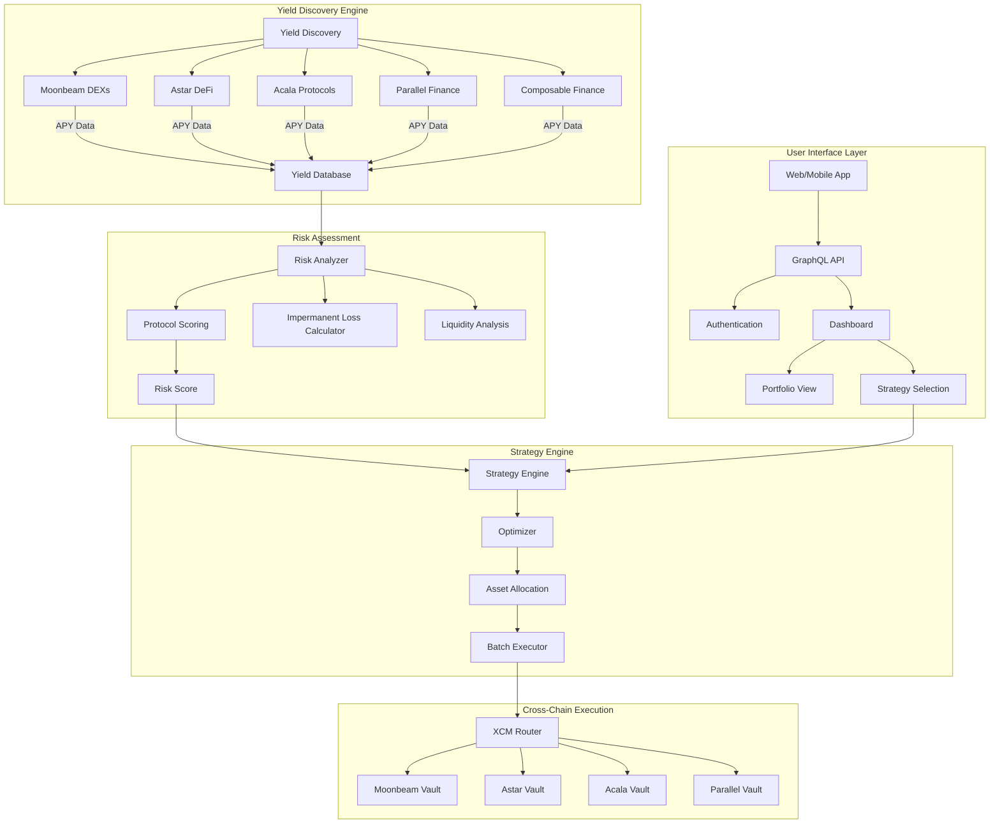
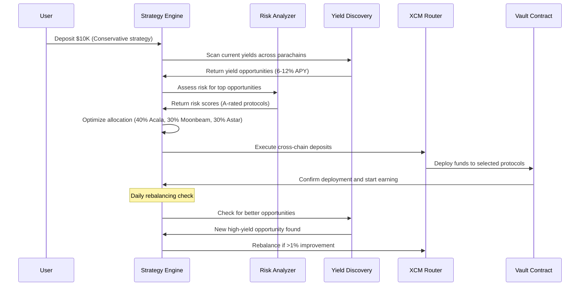
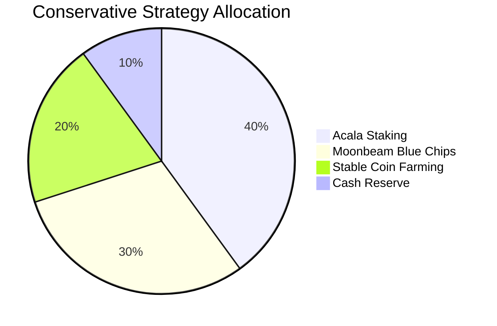
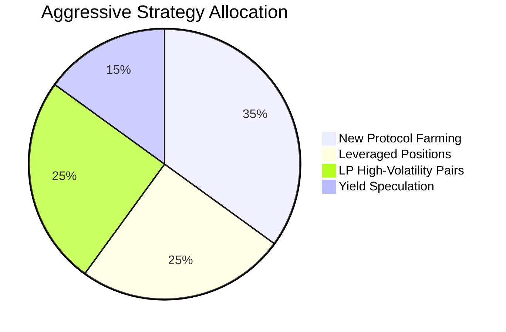
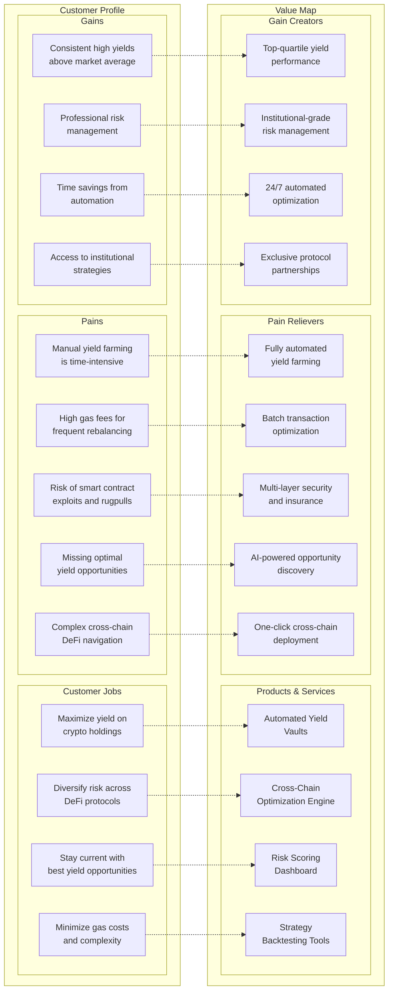
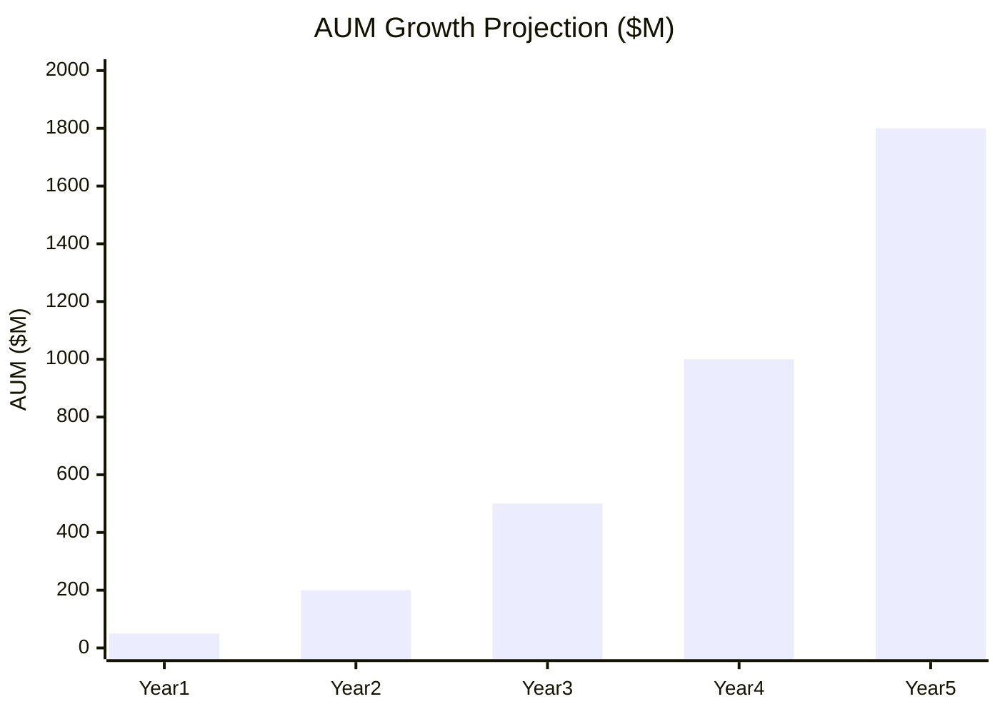
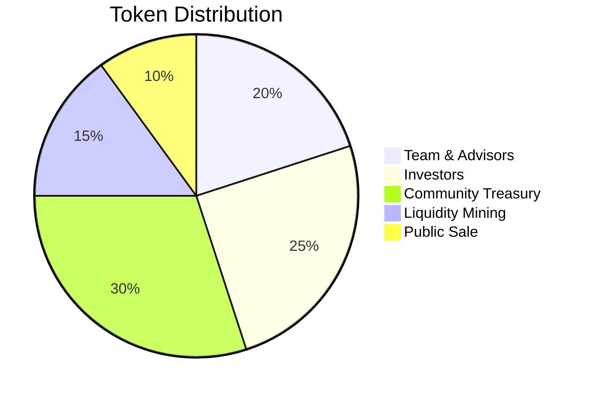

# Cross-Parachain DeFi Yield Aggregator

## Problem Statement
Polkadot's multi-chain architecture creates fragmented DeFi opportunities across parachains. Users struggle to discover optimal yield strategies and manually managing positions across multiple chains is inefficient and costly.

## Proposed Solution
An intelligent yield aggregator that automatically allocates capital across Polkadot DeFi protocols, optimizing for risk-adjusted returns while managing cross-chain complexity transparently.

## Key Features
- **Yield Discovery Engine**: Automated scanning of DeFi opportunities across all parachains
- **Risk Assessment**: ML-powered protocol safety scoring and impermanent loss analysis
- **Automated Rebalancing**: Dynamic capital allocation based on changing yield landscapes
- **Cross-Chain Optimization**: Minimize bridge fees through intelligent batching and routing
- **Vault Strategies**: Pre-configured risk profiles (Conservative, Balanced, Aggressive)

## Platform Architecture



## Yield Optimization Flow



## Vault Strategy Types





## Technical Considerations
- **Multi-Chain Integration**: Native support for Moonbeam, Astar, Acala, Parallel, and other DeFi parachains
- **Smart Contract Architecture**: Upgradeable vault contracts with emergency safeguards
- **Oracle Dependencies**: Real-time yield and price data from multiple sources
- **Gas Optimization**: Batch transactions and optimal timing for cross-chain operations
- **Governance Token**: Protocol governance for strategy approval and parameter updates

## Revenue Streams
- **Management Fees**: 1-2% annual fee on assets under management
- **Performance Fees**: 10-20% of excess returns above benchmark
- **Token Economics**: Governance token with fee sharing and voting rights
- **Premium Features**: Advanced analytics and custom strategy development

## Competitive Analysis
- **Yearn Finance**: Ethereum-focused, limited cross-chain capabilities
- **Beefy Finance**: Multi-chain but limited Polkadot integration
- **Opportunity**: First mover advantage in Polkadot ecosystem aggregation

## Web3 Foundation Grant Potential
- **Ecosystem Infrastructure**: Critical DeFi infrastructure for Polkadot adoption
- **Cross-Chain Innovation**: Showcases XCM capabilities for financial applications
- **TVL Growth**: Potential to significantly increase locked value across parachains

## Business Model Canvas

```mermaid
graph TB
    subgraph "Key Partners"
        KP1[DeFi Protocols<br/>Acala, Moonbeam, Astar]
        KP2[Bridge Providers<br/>XCM Infrastructure]
        KP3[Data Providers<br/>Yield APIs, Price Feeds]
        KP4[Custody Partners<br/>Wallet Integrations]
    end

    subgraph "Key Activities"
        KA1[Yield Discovery<br/>Multi-chain scanning]
        KA2[Risk Assessment<br/>Protocol analysis]
        KA3[Portfolio Management<br/>Auto-rebalancing]
        KA4[Smart Contract<br/>Development & Audits]
    end

    subgraph "Value Propositions"
        VP1[Maximum Yield<br/>Cross-chain optimization]
        VP2[Automated Management<br/>Set-and-forget investing]
        VP3[Risk Diversification<br/>Multi-protocol exposure]
        VP4[Professional Tools<br/>Institutional-grade platform]
    end

    subgraph "Customer Relationships"
        CR1[Digital Platform<br/>Web/Mobile interface]
        CR2[Community Governance<br/>DAO voting rights]
        CR3[Premium Support<br/>Institutional clients]
        CR4[Educational Resources<br/>DeFi strategy guides]
    end

    subgraph "Customer Segments"
        CS1[DeFi Yield Farmers<br/>$5K-$500K portfolios]
        CS2[Institutional Investors<br/>$500K+ allocations]
        CS3[Crypto Passive Investors<br/>Long-term holders]
        CS4[DAOs & Treasuries<br/>Organizational funds]
    end

    subgraph "Key Resources"
        KR1[Yield Optimization<br/>Algorithms]
        KR2[DeFi Engineering<br/>Team expertise]
        KR3[Smart Contracts<br/>Vault infrastructure]
        KR4[Governance Token<br/>Protocol ownership]
    end

    subgraph "Channels"
        CH1[DeFi Aggregators<br/>1inch, Paraswap]
        CH2[Direct Platform<br/>Web application]
        CH3[Wallet Integrations<br/>MetaMask, Talisman]
        CH4[Partnership Network<br/>Protocol collaborations]
    end

    subgraph "Cost Structure"
        COST1[Development: 45%<br/>Smart contracts, UI]
        COST2[Operations: 25%<br/>Gas, bridge fees]
        COST3[Security: 20%<br/>Audits, insurance]
        COST4[Marketing: 10%<br/>Community building]
    end

    subgraph "Revenue Streams"
        REV1[Management Fees: 50%<br/>1-2% annual AUM]
        REV2[Performance Fees: 35%<br/>10-20% excess returns]
        REV3[Token Appreciation: 10%<br/>Governance token value]
        REV4[Partner Rewards: 5%<br/>Protocol incentives]
    end
```



## Value Proposition Canvas



## Financial Model

### Assets Under Management Growth



### Unit Economics

| Metric | Conservative | Aggressive | Notes |
|--------|-------------|-----------|--------|
| **Average Deposit** | $50,000 | $25,000 | Blended user base |
| **Management Fee** | 1.5% | 2.0% | Annual AUM fee |
| **Performance Fee** | 10% | 20% | Excess returns only |
| **Annual Yield Generated** | 12% | 18% | Net after costs |
| **Excess Return** | 4% | 8% | Above 8% benchmark |
| **Revenue per $100K AUM** | $1,900 | $4,600 | Annual |
| **Customer Acquisition Cost** | $250 | $400 | Marketing spend |
| **Customer Lifetime Value** | $15,000 | $35,000 | 5-year retention |

### Revenue Projections

| Year | AUM ($M) | Management Fees ($M) | Performance Fees ($M) | Total Revenue ($M) | Operating Costs ($M) | Net Profit ($M) |
|------|----------|-------------------|---------------------|-------------------|------------------|----------------|
| **1** | 50 | 0.75 | 2.0 | **2.75** | 4.5 | **(1.75)** |
| **2** | 200 | 3.0 | 8.0 | **11.0** | 12.0 | **(1.0)** |
| **3** | 500 | 7.5 | 20.0 | **27.5** | 22.0 | **5.5** |
| **4** | 1,000 | 15.0 | 40.0 | **55.0** | 35.0 | **20.0** |
| **5** | 1,800 | 27.0 | 72.0 | **99.0** | 55.0 | **44.0** |

### Token Economics Model



| Token Utility | Mechanism | Value Driver |
|-------------|-----------|------------|
| **Governance Rights** | Vote on strategy changes | Platform control premium |
| **Fee Sharing** | 50% of profits to stakers | Yield on token holdings |
| **Vault Access** | Premium strategies for holders | Exclusive opportunity access |
| **Reduced Fees** | Discounted management fees | Cost savings incentive |

### Break-Even Analysis

```mermaid
xychart-beta
    title "Monthly Cash Flow ($M)"
    x-axis [M6, M12, M18, M24, M30, M36]
    y-axis "Cash Flow ($M)" -2 --> 8
    line [(-1.5), (-1.2), (-0.5), 1.5, 4.2, 7.8]
```

**Break-even achieved in Month 20**

### Funding Strategy

**Seed Round: $5M**
- Valuation: $25M pre-money
- Use: MVP development, initial partnerships
- Timeline: 18-month runway

**Series A: $15M**
- Valuation: $100M pre-money
- Use: Scale operations, international expansion
- Target: $200M+ AUM milestone

**Token Generation Event: $20M**
- Public token sale for decentralization
- Community governance transition
- Liquidity mining program launch

### Risk Factors & Mitigation

| Risk | Impact | Probability | Mitigation |
|------|--------|-------------|------------|
| Smart contract exploit | High | Medium | Multiple audits, insurance |
| Regulatory changes | High | Medium | Legal compliance, jurisdiction diversification |
| Competition from established players | Medium | High | First-mover advantage, superior UX |
| DeFi market downturn | High | Low | Diversified strategies, bear market pivots |

## Next Steps
1. Comprehensive audit of current Polkadot DeFi landscape and yields
2. Technical feasibility study on cross-chain yield optimization
3. Partnership discussions with major Polkadot DeFi protocols
4. Tokenomics design and governance framework development