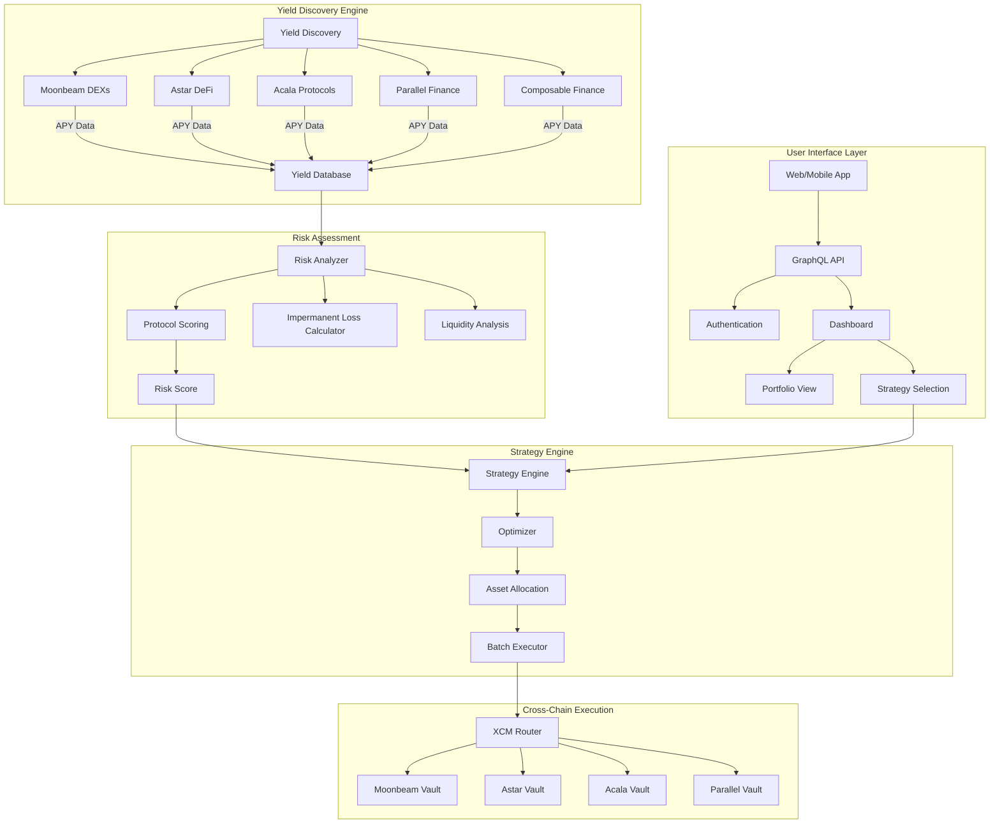
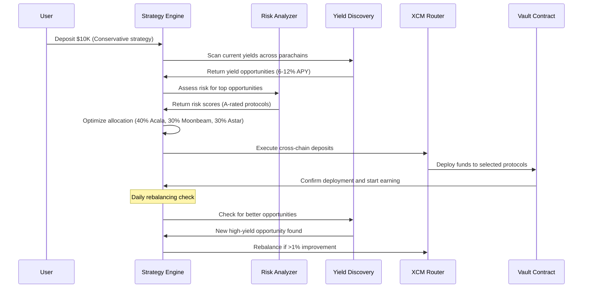
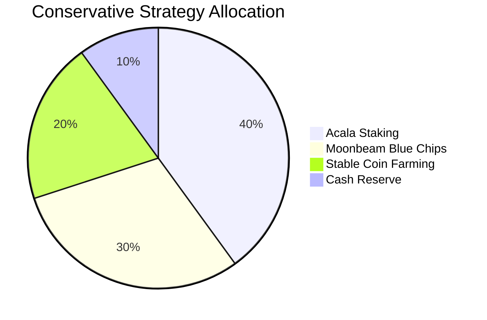
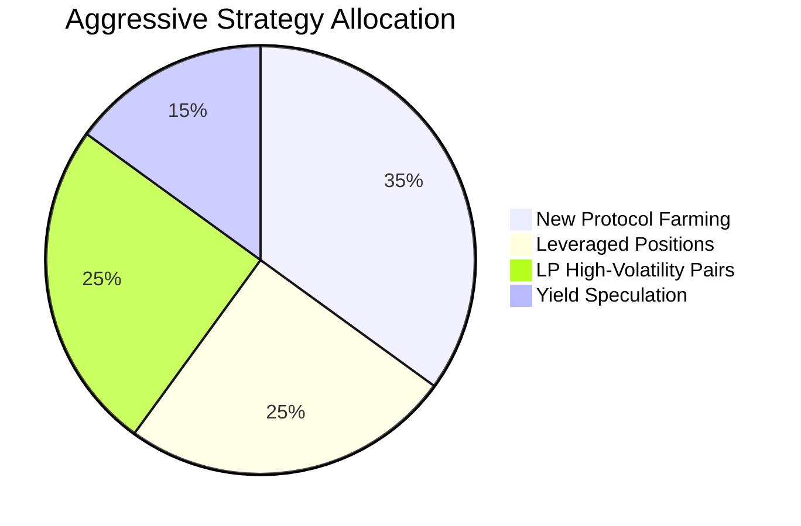

# Cross-Parachain DeFi Yield Aggregator

## Problem Statement
Polkadot's multi-chain architecture creates fragmented DeFi opportunities across parachains. Users struggle to discover optimal yield strategies and manually managing positions across multiple chains is inefficient and costly.

## Proposed Solution
An intelligent yield aggregator that automatically allocates capital across Polkadot DeFi protocols, optimizing for risk-adjusted returns while managing cross-chain complexity transparently.

## Key Features
- **Yield Discovery Engine**: Automated scanning of DeFi opportunities across all parachains
- **Risk Assessment**: ML-powered protocol safety scoring and impermanent loss analysis
- **Automated Rebalancing**: Dynamic capital allocation based on changing yield landscapes
- **Cross-Chain Optimization**: Minimize bridge fees through intelligent batching and routing
- **Vault Strategies**: Pre-configured risk profiles (Conservative, Balanced, Aggressive)

## Platform Architecture

## Yield Optimization Flow

## Vault Strategy Types

## Technical Considerations
- **Multi-Chain Integration**: Native support for Moonbeam, Astar, Acala, Parallel, and other DeFi parachains
- **Smart Contract Architecture**: Upgradeable vault contracts with emergency safeguards
- **Oracle Dependencies**: Real-time yield and price data from multiple sources
- **Gas Optimization**: Batch transactions and optimal timing for cross-chain operations
- **Governance Token**: Protocol governance for strategy approval and parameter updates

## Revenue Streams
- **Management Fees**: 1-2% annual fee on assets under management
- **Performance Fees**: 10-20% of excess returns above benchmark
- **Token Economics**: Governance token with fee sharing and voting rights
- **Premium Features**: Advanced analytics and custom strategy development

## Competitive Analysis
- **Yearn Finance**: Ethereum-focused, limited cross-chain capabilities
- **Beefy Finance**: Multi-chain but limited Polkadot integration
- **Opportunity**: First mover advantage in Polkadot ecosystem aggregation

## Web3 Foundation Grant Potential
- **Ecosystem Infrastructure**: Critical DeFi infrastructure for Polkadot adoption
- **Cross-Chain Innovation**: Showcases XCM capabilities for financial applications
- **TVL Growth**: Potential to significantly increase locked value across parachains

## Next Steps
1. Comprehensive audit of current Polkadot DeFi landscape and yields
2. Technical feasibility study on cross-chain yield optimization
3. Partnership discussions with major Polkadot DeFi protocols
4. Tokenomics design and governance framework development