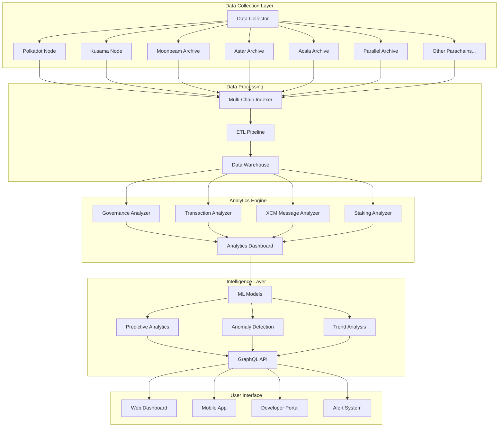
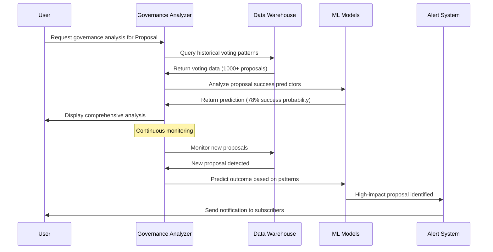
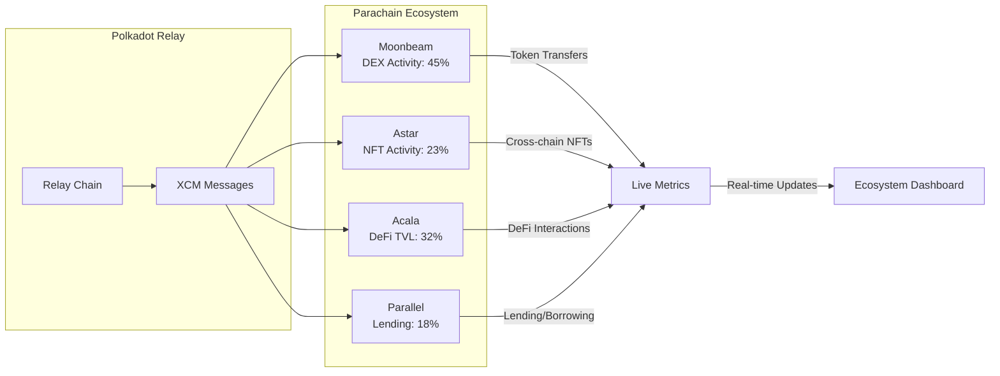
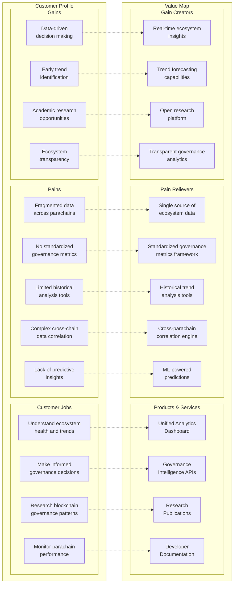
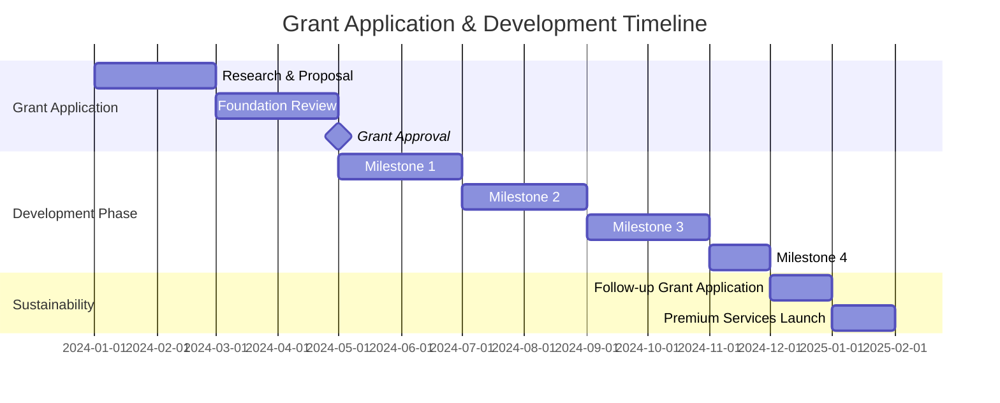
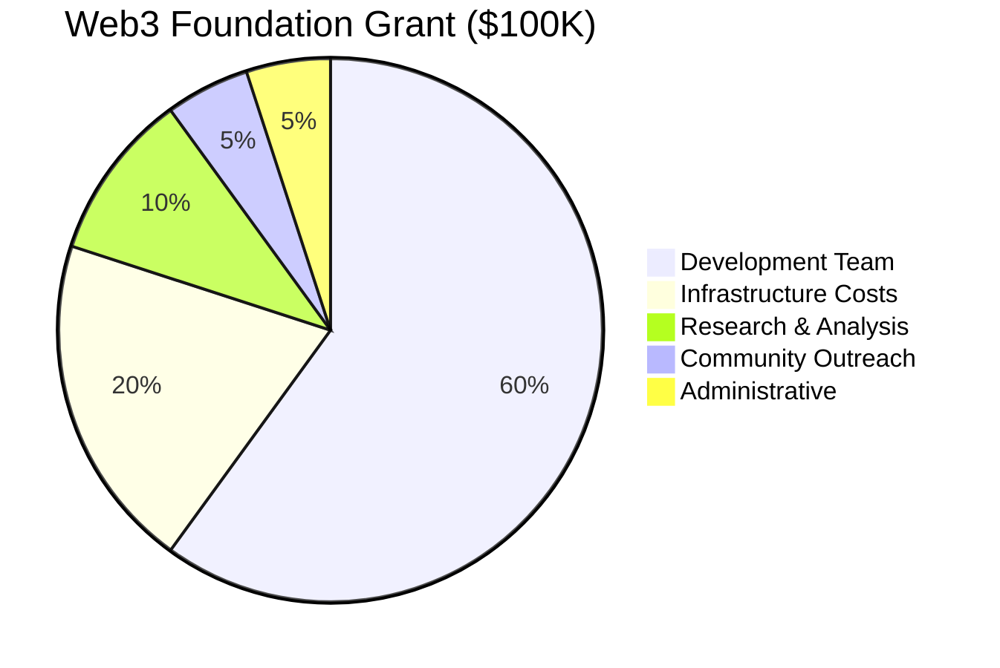
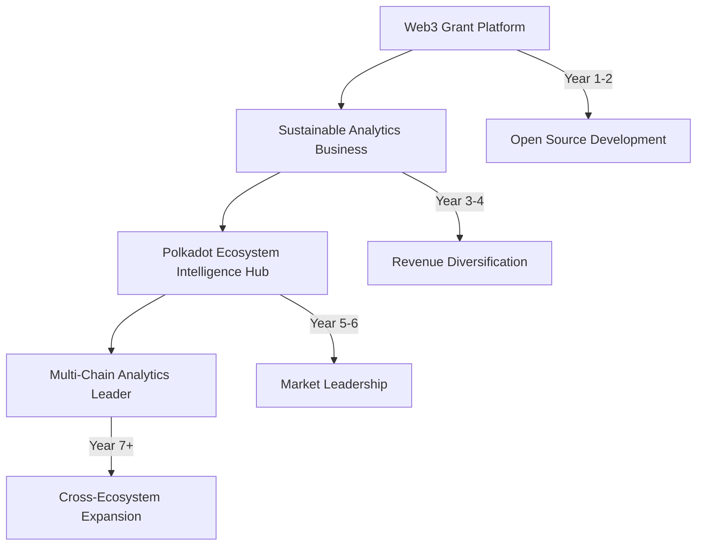

# Parachain Analytics & Governance Intelligence Platform

## Problem Statement
Polkadot ecosystem lacks comprehensive analytics tools for tracking cross-parachain activities, governance participation, and ecosystem health metrics. Current tools are fragmented and don't provide holistic ecosystem insights.

## Proposed Solution
A comprehensive analytics platform that aggregates data across all parachains, provides governance insights, and offers predictive analytics for ecosystem growth and token performance.

## Key Features
- **Cross-Chain Data Aggregation**: Real-time collection of transaction, staking, and governance data from all parachains
- **Governance Dashboard**: Track proposal success rates, voter participation, and delegation patterns
- **Ecosystem Health Metrics**: Monitor parachain slot auctions, crowdloan participation, and cross-chain message volume
- **Predictive Analytics**: ML models for forecasting governance outcomes and token price movements
- **Developer Tools**: APIs and SDKs for integrating analytics into other applications

## Platform Architecture

## Governance Intelligence Flow

## Cross-Chain Activity Dashboard

## Technical Considerations
- **Substrate Archive**: Utilize archive nodes for historical data analysis
- **GraphQL APIs**: Provide flexible data querying for external developers
- **Real-time Indexing**: Custom indexers for each parachain's unique data structures
- **Data Warehouse**: Scalable storage solution for historical trend analysis
- **Privacy-First**: On-chain analytics without compromising user privacy

## Web3 Foundation Grant Alignment
- **Ecosystem Growth**: Supports informed decision-making across the Polkadot ecosystem
- **Developer Experience**: Provides tools that make building on Polkadot more accessible
- **Governance Enhancement**: Improves democratic participation through better information
- **Research Enablement**: Supports academic and commercial research into blockchain governance

## Grant Application Strategy
- **Tier 2 Grant Target**: $30,000-$100,000 for MVP development
- **Deliverables**:
  - Open-source analytics engine
  - Public dashboard with key ecosystem metrics
  - Developer documentation and APIs
  - Research paper on governance patterns
- **Timeline**: 6-month development cycle with monthly milestones

## Business Model Canvas

```mermaid
graph TB
    subgraph "Key Partners"
        KP1[Web3 Foundation<br/>Grant funding & guidance]
        KP2[Parachain Teams<br/>Moonbeam, Acala, Astar]
        KP3[Research Institutions<br/>Universities, think tanks]
        KP4[Data Infrastructure<br/>Archive nodes, indexers]
    end

    subgraph "Key Activities"
        KA1[Data Collection<br/>Multi-chain indexing]
        KA2[Analytics Development<br/>ML model training]
        KA3[Research Publication<br/>Academic papers]
        KA4[Community Building<br/>Developer outreach]
    end

    subgraph "Value Propositions"
        VP1[Comprehensive Data<br/>Ecosystem-wide insights]
        VP2[Governance Intelligence<br/>Predictive analytics]
        VP3[Open Source Tools<br/>Free developer access]
        VP4[Research Quality<br/>Academic rigor]
    end

    subgraph "Customer Relationships"
        CR1[Open Source Community<br/>GitHub, documentation]
        CR2[Academic Network<br/>Research collaborations]
        CR3[Developer Support<br/>API documentation]
        CR4[Grant Reporting<br/>Web3 Foundation updates]
    end

    subgraph "Customer Segments"
        CS1[Polkadot Developers<br/>dApp builders, researchers]
        CS2[Academic Researchers<br/>Blockchain governance studies]
        CS3[Parachain Teams<br/>Performance monitoring]
        CS4[Token Holders<br/>Governance participants]
    end

    subgraph "Key Resources"
        KR1[Archive Node Access<br/>Historical blockchain data]
        KR2[Analytics Expertise<br/>Data science team]
        KR3[Research Reputation<br/>Academic credibility]
        KR4[Grant Funding<br/>Web3 Foundation support]
    end

    subgraph "Channels"
        CH1[Public Dashboard<br/>Web-based interface]
        CH2[Developer APIs<br/>GraphQL endpoints]
        CH3[Research Publications<br/>Academic journals]
        CH4[Community Forums<br/>Polkadot governance]
    end

    subgraph "Cost Structure"
        COST1[Development: 50%<br/>Engineering team]
        COST2[Infrastructure: 30%<br/>Servers, data storage]
        COST3[Research: 15%<br/>Academic partnerships]
        COST4[Operations: 5%<br/>Maintenance, support]
    end

    subgraph "Revenue Streams"
        REV1[Grant Funding: 80%<br/>Web3 Foundation grants]
        REV2[Premium APIs: 15%<br/>Enterprise developers]
        REV3[Consulting: 3%<br/>Custom analytics]
        REV4[Academic Funding: 2%<br/>Research grants]
    end
```

## Value Proposition Canvas

## Financial Model (Grant-Focused)

### Web3 Foundation Grant Timeline

### Grant Budget Allocation

### Project Economics

| Phase | Duration | Grant Amount | Team Size | Key Deliverables |
|-------|----------|-------------|-----------|------------------|
| **Phase 1** | 6 months | $100,000 | 3 developers | MVP platform, basic analytics |
| **Phase 2** | 6 months | $150,000 | 5 team members | Advanced ML, governance insights |
| **Phase 3** | 12 months | $200,000 | 8 team members | Full ecosystem coverage, research |

### Sustainability Model

**Year 1-2: Grant-Funded Development**
- Total grants: $450,000
- Focus: Open-source development, community building
- Output: Research papers, open APIs, developer tools

**Year 3+: Revenue Diversification**
| Revenue Stream | Annual Target | Description |
|---------------|---------------|-------------|
| **Enterprise APIs** | $200,000 | Premium data access for institutions |
| **Custom Analytics** | $150,000 | Bespoke analysis for parachain teams |
| **Research Partnerships** | $100,000 | University collaborations |
| **Training & Workshops** | $50,000 | Educational content monetization |

### Impact Metrics

| Metric | Year 1 Target | Year 2 Target | Year 3 Target |
|--------|---------------|---------------|---------------|
| **API Calls/Month** | 100K | 500K | 2M |
| **Research Papers Published** | 2 | 5 | 10 |
| **Developer Integrations** | 10 | 50 | 200 |
| **Parachain Coverage** | 10 | 25 | 50+ |
| **GitHub Stars** | 500 | 2,000 | 5,000 |

### Long-term Vision

## Next Steps
1. Research existing analytics solutions and identify gaps
2. Engage with Web3 Foundation on grant requirements and priorities
3. Partner with parachains for data access and validation
4. Develop technical architecture and implementation plan