# XCM Developer Toolkit & Testing Framework

## Problem Statement
Cross-Consensus Messaging (XCM) development is complex and error-prone. Developers lack comprehensive testing tools, debugging capabilities, and standardized patterns for building cross-chain applications.

## Proposed Solution
A comprehensive developer toolkit that simplifies XCM development through testing frameworks, debugging tools, code generators, and best practice templates.

## Key Features
- **XCM Testing Framework**: Local testnet setup with multiple parachains for XCM testing
- **Message Debugging Tools**: Visual trace analysis for XCM message execution and failures
- **Code Generation**: Templates and scaffolding for common XCM patterns
- **Integration Testing**: Automated testing suite for cross-chain application deployment
- **Documentation Hub**: Interactive tutorials and real-world examples

## Toolkit Architecture

## XCM Development Workflow

```mermaid
sequenceDiagram
    participant DEV as Developer
    participant IDE as IDE Extension
    participant TEST as Test Framework
    participant SIM as Simulator
    participant ZN as Zombienet
    participant VIZ as Visualizer

    DEV->>IDE: Write XCM message logic
    IDE->>DEV: Provide real-time validation
    DEV->>TEST: Run local tests
    TEST->>SIM: Simulate message execution
    SIM->>TEST: Return execution results
    DEV->>ZN: Deploy to test environment
    ZN->>VIZ: Trace message flow
    VIZ->>DEV: Display visual execution path

    Note over DEV: Ready for mainnet
    DEV->>TEST: Final integration tests
    TEST->>DEV: All tests pass ✓
```

## Testing Framework Components

## Error Detection & Debugging

## Technical Considerations
- **Zombienet Integration**: Leverage existing parachain testing infrastructure
- **IDE Extensions**: VSCode/IntelliJ plugins for XCM development
- **Simulation Engine**: Dry-run XCM messages before mainnet deployment
- **Error Cataloging**: Comprehensive database of XCM error patterns and solutions
- **Performance Profiling**: Tools for optimizing XCM message costs and timing

## Web3 Foundation Grant Alignment
- **Developer Adoption**: Significantly reduces barrier to entry for cross-chain development
- **Ecosystem Reliability**: Reduces bugs and failures in production XCM applications
- **Education Impact**: Accelerates developer onboarding to Polkadot ecosystem
- **Innovation Enablement**: Enables more complex cross-chain applications

## Grant Application Strategy
- **Tier 3 Grant Target**: $100,000+ for comprehensive toolkit development
- **Deliverables**:
  - Open-source testing framework with CI/CD integration
  - IDE extensions for major development environments
  - Comprehensive documentation and tutorial series
  - Reference implementations for common use cases
- **Timeline**: 8-month development with community feedback integration

## Market Impact
- **Developer Velocity**: 10x faster XCM application development
- **Quality Improvement**: 50% reduction in cross-chain bugs
- **Ecosystem Growth**: Enable 100+ new cross-chain projects annually
- **Educational Value**: Support university blockchain development programs

## Next Steps
1. Survey current XCM developers for pain points and requirements
2. Analyze existing testing frameworks for integration opportunities
3. Create detailed technical specification with Web3 Foundation input
4. Build proof-of-concept demonstrating core functionality